# Repository Context for Coding Agents

> How should you feed durable project, library, and dependency knowledge to AI coding agents?

This document compares every major approach — from native git mechanisms to dedicated tools and services — for providing repository context to coding agents like Claude Code, Codex, Cursor, Copilot, Jules, and others.

The comparison is informed by the [Effect team's recommendation](https://effect.website/blog/the-one-weird-git-trick-that-makes-coding-agents-more-effect-ive/) that **git subtree** is the most effective method. We extend their analysis to cover the full landscape.

---

## The Big Picture

```mermaid
flowchart TB
  Q["AI coding agent needs<br/>repository context"]

  subgraph Embed["Embed in workspace (offline, native tools)"]
    direction TB
    E1["git subtree (raw)"]
    E2["ingraft (this project)"]
    E3["Vendir"]
    E4["git submodule"]
    E5["git clone"]
    E6["OpenSrc (lazy cache)"]
  end

  subgraph Retrieve["Retrieve on demand (online, MCP / API)"]
    direction TB
    R1["Context7 (docs)"]
    R2["Repobase (semantic search)"]
    R3["mgrep (semantic grep)"]
    R4["BTCA (AI Q&A)"]
    R5["RepoSwarm (org architecture)"]
  end

  subgraph Package["Package & inject"]
    direction TB
    P1["Repomix"]
  end

  subgraph Instruct["Instruct"]
    direction TB
    I1["Skills (SKILL.md)"]
  end

  Q --> Embed
  Q --> Retrieve
  Q --> Package
  Q --> Instruct

  style Embed fill:#1e3a5f,stroke:#4a90d9,color:#fff
  style Retrieve fill:#5f1e3a,stroke:#d9904a,color:#fff
  style Package fill:#3a5f1e,stroke:#90d94a,color:#fff
  style Instruct fill:#5f3a1e,stroke:#d94a90,color:#fff
```

**Four route families**:

- **Embed** — vendor source code into the workspace. Agent uses its native `Read` / `grep` / `find`. Offline. Highest signal density.
- **Retrieve** — query an external service for code or docs. No repo bloat. Network dependency.
- **Package** — snapshot a repo into a single file. Good for chat, weaker for agents.
- **Instruct** — give the agent rules instead of code. Use _with_ one of the above, not instead.

The 2026 shift is that agents increasingly run across local terminals, cloud
worktrees, PR queues, web apps, and mobile handoffs. That makes the repository
itself the most durable context contract. Vendored source is the deepest route,
but it is one route in a broader routing problem.

---

## The Problem

AI coding agents struggle with libraries and frameworks that are:

- **Not well-represented** in their training data
- **Recently updated** with new APIs or breaking changes
- **Complex** with nuanced patterns that require understanding internals

The Effect team's key insight: **source code is the highest-signal context**. It contains types, implementation details, docstrings, and tests — all in a format coding agents are already built to navigate.

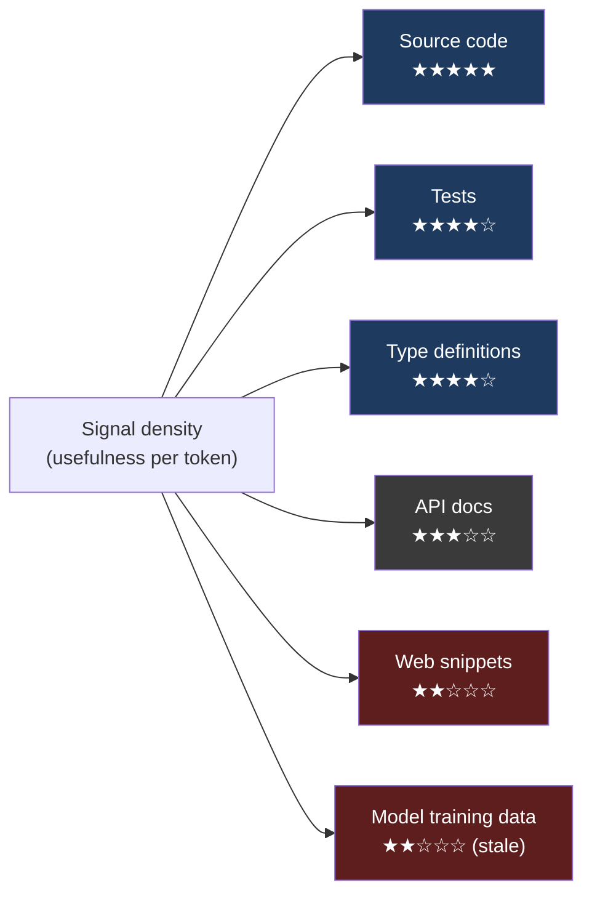

---

## Approach Categories

| Category                       | Approaches                             | Key Trait                                  |
| ------------------------------ | -------------------------------------- | ------------------------------------------ |
| **Git-native (raw)**           | Subtree, Submodule, Clone              | Source in workspace, no extra tooling      |
| **Git-subtree wrappers**       | **ingraft** (this project), **Vendir** | Ergonomic CLI over `git subtree` + hygiene |
| **Context packaging**          | Repomix                                | Pack repo into single AI file (+ MCP mode) |
| **On-demand source fetch**     | OpenSrc                                | Lazy clone of npm/PyPI/crates source       |
| **Local semantic search**      | Repobase                               | Local vector index via MCP                 |
| **Cloud semantic grep**        | mgrep                                  | Cloud-indexed semantic search CLI          |
| **Doc retrieval**              | Context7                               | Hosted MCP for 33K+ library docs           |
| **AI-mediated Q&A**            | BTCA / BTCA-3                          | Clone + LLM-grounded answers               |
| **Org architecture discovery** | RepoSwarm                              | Multi-repo `.arch.md` via Temporal         |
| **Agent instructions**         | Skills                                 | Curated guidance, progressive disclosure   |

---

## Detailed Comparison

### 1. Git Subtree (raw)

Merges an external repo's source code directly into a subdirectory of your project. Code becomes part of your repo's tree and history.

```bash
git subtree add --prefix=vendor/effect https://github.com/Effect-TS/effect.git main --squash
git subtree pull --prefix=vendor/effect https://github.com/Effect-TS/effect.git main --squash
```

In Maxwell Brown's blog post, the Effect team argued (qualitatively) that agents go from being ineffective with Effect to producing high-quality code once Effect's source is vendored. The agent can grep types, read implementations, follow import chains — using native tools.

| ✅ Strengths                         | ❌ Weaknesses                                         |
| ------------------------------------ | ----------------------------------------------------- |
| Highest-signal context (full source) | Repo size grows                                       |
| Works with every agent               | Verbose, error-prone raw commands                     |
| Native `grep` / `find` / `Read`      | No automatic hygiene (`.gitattributes`, IDE excludes) |
| No network at runtime                | Manual to select repos/branches                       |
| Reproducible (committed)             | Subtree pull can conflict (rare with `--squash`)      |
| `git subtree pull` for updates       | Agents may read irrelevant files                      |

**Best for**: Libraries with complex APIs or poor LLM training coverage. The Effect team's preferred approach — but most users benefit from a wrapper.

---

### 2. ingraft (this project)

**npm**: [`ingraft`](https://www.npmjs.com/package/ingraft) · **Skill**: `ingraft` (Claude Code)

Opinionated repository-context CLI. Its primary route wraps git subtree, git submodules, local ignored clones, and shared cache-linked checkouts. It also detects and wraps lighter context routes such as Repomix snapshots, OpenSrc lazy source fetches, and local search tools. Distributed both as a standalone npm package and as a Claude Code skill. Built on Effect-TS.

```bash
bunx ingraft@latest                          # scan package.json, ask what context to add
bunx ingraft@latest init                     # set up context/vendoring policy
bunx ingraft@latest add effect               # alias → Effect-TS/effect
bunx ingraft@latest add effect --tag v3.21.2 # pin to a tag
bunx ingraft@latest add effect --sync-package effect      # follow npm version
bunx ingraft@latest add effect --strategy submodule       # alt strategy
bunx ingraft@latest add effect --strategy clone-ignore    # alt strategy
bunx ingraft@latest add effect --strategy cache-link      # shared local cache
bunx ingraft@latest add effect --exclude-dir docs --max-file-size 1MB
bunx ingraft@latest fork Effect-TS/effect                 # editable fork + read-only vendor
bunx ingraft@latest update --all
bunx ingraft@latest doctor                   # diagnose hygiene
bunx ingraft@latest doctor --fix             # repair generated hygiene files
bunx ingraft@latest refresh                  # regenerate agent docs, ignores
bunx ingraft@latest context                  # detect curated optional context tools
bunx ingraft@latest context pack --compress  # wrap Repomix for a vendor snapshot
bunx ingraft@latest context source zod       # wrap OpenSrc for long-tail source
```

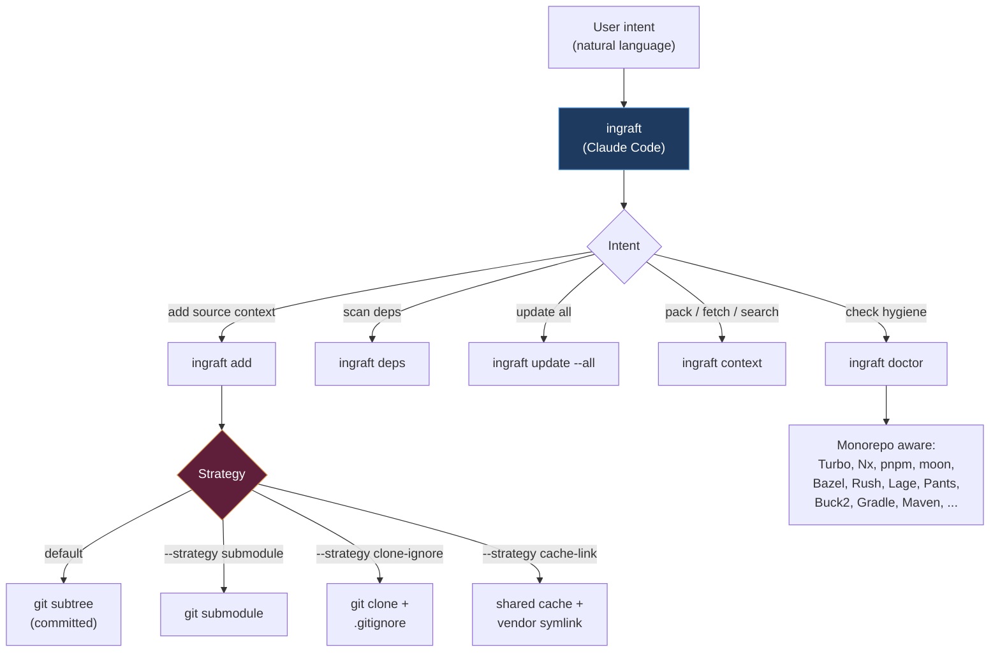

| ✅ Strengths                                                                                               | ❌ Weaknesses                        |
| ---------------------------------------------------------------------------------------------------------- | ------------------------------------ |
| **Four strategies**: subtree / submodule / clone-ignore / cache-link                                       | Newer project, small community       |
| **Auto-scans package manifests** for candidates                                                            | Multi-strategy surface area to learn |
| **Repo aliases**: `effect` → `Effect-TS/effect`                                                            | Effect-TS dependency (internal)      |
| **Package-version sync** (`--sync-package`)                                                                |                                      |
| **File filtering**: ext / dir / globs / size                                                               |                                      |
| **Ref control**: `--ref` / `--tag` / `--release`                                                           |                                      |
| **Monorepo support**: Turbo, Nx, Lerna, pnpm, moon, Bazel, Rush, Lage, Pants, Buck2, Gradle, Maven, Please |                                      |
| **Agent skill distribution** — natural-language routing                                                    |                                      |
| Hygiene automation (`.gitattributes`, IDE excludes, tool ignores)                                          |                                      |
| Optional context-tool routing for Repomix / OpenSrc / Repobase                                             |                                      |
| Destructive history rewrite option for full removal                                                        |                                      |

**Best for**: Teams that want the repository to become the context contract for agents. Use the vendoring routes for deep, version-matched source context; use `fork` when upstream source needs an editable sibling checkout plus a read-only vendor projection; use the context wrappers for lighter packs, lazy source lookup, and search.

---

### 3. Vendir

**GitHub**: [grovemotorco/vendir](https://github.com/grovemotorco/vendir) · **npm**: `vendir` · MIT

Minimalist CLI wrapper around `git subtree`. Created May 12, 2026 — concurrent with this project and explicitly inspired by the Effect blog post. Pure subtree-only.

```bash
npm install -g vendir
vendir init                       # vendir.toml at git root
vendir add effect https://github.com/Effect-TS/effect.git
vendir sync                       # refresh all
vendir sync effect                # refresh one
vendir remove effect
vendir doctor --fix               # repair .gitattributes, VS Code excludes
```

| ✅ Strengths                                 | ❌ Weaknesses                                    |
| -------------------------------------------- | ------------------------------------------------ |
| Simpler scope — subtree only                 | **Subtree only** — no submodule / clone fallback |
| `vendir.toml` is human-readable, committable | **No package manifest scanning**                 |
| `doctor --fix` repairs hygiene automatically | **No repository aliases**                        |
| Per-repo prefix overrides                    | **No file filtering**                            |
| Compatible with raw `git subtree` commands   | **No package-version sync**                      |
| 49-test suite, MIT                           | **Branch-only refs** — no tag / release          |
| Node-only distribution                       | **No agent skill** — pure CLI                    |
|                                              | **Limited monorepo awareness**                   |
|                                              | Created May 12, 2026 — 0 stars, no community yet |

**Best for**: Users who want a minimal ergonomic wrapper around git subtree. Good fit if you already know which repos to vendor and just want shorter commands.

---

### 4. Git Submodule

Stores a pointer to a specific commit in an external repo. Your repo holds a reference, not a copy.

```bash
git submodule add https://github.com/Effect-TS/effect.git vendor/effect
git submodule update --init --recursive
```

| ✅ Strengths                          | ❌ Weaknesses                                                 |
| ------------------------------------- | ------------------------------------------------------------- |
| Tiny repo size — just a pointer       | **Agents routinely fail to initialize** — see empty directory |
| Explicit commit pinning               | Requires extra `submodule init && update` step                |
| Bidirectional (easy to push upstream) | Nested `.git` directories confuse agents                      |
|                                       | `.gitmodules` metadata adds friction                          |
|                                       | Detached-HEAD failures common                                 |
|                                       | CI needs `--recurse-submodules`                               |

**Best for**: Fork-backed editable vendors, where the parent repository must commit a gitlink to a patch branch. **Not recommended as the default read-only agent context path** because initialization failures are a reliability risk. Use subtree or cache-linked projections for read-only source; use `ingraft fork` when edits can live in a sibling checkout beside the host repo.

---

### 5. Git Clone (into workspace)

```bash
git clone https://github.com/Effect-TS/effect.git ~/reference/effect
# Then tell agent: "read ~/reference/effect/src for patterns"
```

| ✅ Strengths           | ❌ Weaknesses                               |
| ---------------------- | ------------------------------------------- |
| Simplest approach      | Not committed — each developer/CI re-clones |
| No impact on host repo | Absolute paths differ across machines       |
| Full source access     | No reproducibility — drifts over time       |
| Easy cleanup           | Not portable in PRs                         |
|                        | `.git` dirs inside can confuse agents       |

**Best for**: Ad-hoc reference in a single session. Not suitable for teams or CI.

---

### 6. Skills (Claude Code & open standard)

**Standard**: [agentskills.io/specification](https://agentskills.io/specification) — 12+ tools (Claude Code, Codex, Gemini CLI, Cursor, VS Code Copilot, …)

Modular instruction packages (`SKILL.md`) that give agents specialized expertise. Progressive disclosure means only name + description load at startup; full content loads on demand.

```
my-skill/
  SKILL.md           # required: frontmatter + instructions
  reference.md       # optional: deep docs, loaded on demand
  examples/          # optional usage examples
  scripts/           # optional executable helpers
```

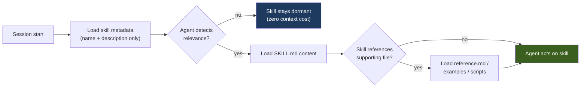

| ✅ Strengths                                    | ❌ Weaknesses                           |
| ----------------------------------------------- | --------------------------------------- |
| **Context efficient** — progressive disclosure  | **Not source code** — instructions only |
| **Portable** across 12+ agent tools             | Curation required, can go stale         |
| **Composable** — references, scripts, subagents | Context budget competition at scale     |
| Version-controlled with the repo                | Static per session                      |
| No git complexity                               | Only as good as the author              |

**Best for**: Wrapping CLIs / codifying conventions. **Best paired with a source-level approach** (subtree, ingraft, OpenSrc). Strongest setups use both.

Examples: Anthropic's official `claude-api` skill, this repo's `ingraft`, BTCA's `btca-cli` skill.

---

### 7. Repomix

**Site**: [repomix.com](https://repomix.com/) · **GitHub**: [yamadashy/repomix](https://github.com/yamadashy/repomix) · ~24,600 stars · MIT · JSNation Open Source Awards 2025 nominee

Open-source TypeScript CLI that packs an entire repository (or parts) into a single LLM-friendly file. Has grown into a full ecosystem.

```bash
npx repomix@latest                   # pack current dir to XML
npx repomix --style markdown         # other formats: xml, md, json, plain
npx repomix --compress               # Tree-sitter AST compression (~70% fewer tokens)
npx repomix --mcp                    # run as MCP server
npx repomix --skill-generate         # generate a Claude Code skill
```

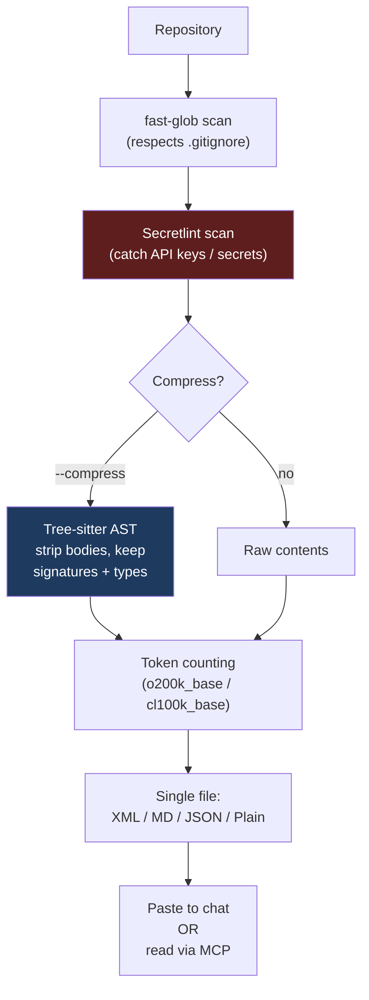

**MCP tools** (when run with `--mcp`):

- `pack_codebase`, `pack_remote_repository`
- `read_repomix_output`, `grep_repomix_output`
- `file_system_read_file`, `file_system_read_directory` (Secretlint-guarded)

| ✅ Strengths                                    | ❌ Weaknesses                                  |
| ----------------------------------------------- | ---------------------------------------------- |
| Most mature tool in this list                   | **Static snapshot** — stale on generation      |
| **Tree-sitter compression** (~70% fewer tokens) | Large repos still exceed context               |
| **Built-in security scanning** (Secretlint)     | No semantic search — packaging tool            |
| Multiple formats (XML, MD, JSON, Plain)         | No cross-repo awareness                        |
| **Remote repo packing** without local clone     | MCP helps but model is still "snapshot a tree" |
| Browser extensions, GH Actions, VS Code, Docker |                                                |
| Web UI at repomix.com                           |                                                |
| Claude Code skill generator                     |                                                |
| ~45,500 weekly npm downloads                    |                                                |

**Best for**: One-shot codebase analysis, web-chat context dumps, CI artifact generation. MCP mode also useful for agents — but vendored source remains stronger for ongoing development.

---

### 8. Repobase

**GitHub**: [fernandoabolafio/repobase](https://github.com/fernandoabolafio/repobase) · MIT · early-stage (~13 stars)

**Fully local** semantic-search system for Git repos, exposing results to agents via MCP. Despite the `.dev` domain it's open source, not SaaS. Bun-based.

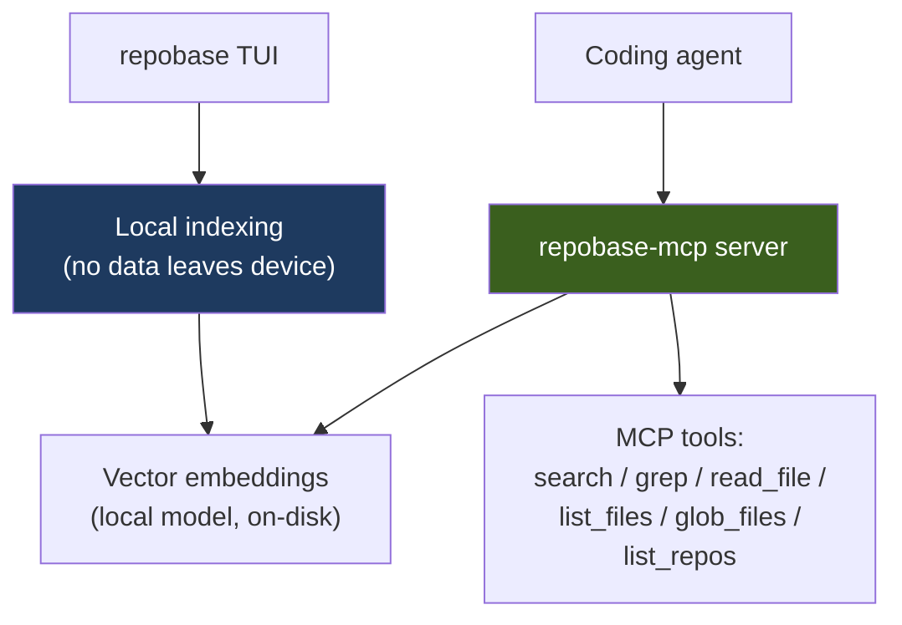

| ✅ Strengths                                      | ❌ Weaknesses                             |
| ------------------------------------------------- | ----------------------------------------- |
| **Fully local & offline** — no SaaS, no API keys  | Very early-stage, small community         |
| Works with private repos safely                   | Requires Bun runtime specifically         |
| 3 modes: keyword / semantic / hybrid              | Embedding model undocumented              |
| Cross-repo search in one query                    | Indexing overhead before queries          |
| MCP-compatible with Cursor, Claude Code, OpenCode | Returns snippets, not navigable workspace |
| Free, MIT                                         | No web UI, no remote-repo support         |

**Best for**: Teams with many private repos who want MCP-exposed semantic search, fully on-device.

---

### 9. mgrep

**GitHub**: [mixedbread-ai/mgrep](https://github.com/mixedbread-ai/mgrep) · 4.1k stars · Apache-2.0 · TypeScript

Cloud-backed semantic grep CLI from Mixedbread. "A calm, CLI-native way to semantically grep everything — code, images, PDFs, and more." Maintains background indexing via `mgrep watch`; files sync to Mixedbread Stores in the cloud.

```bash
npm install -g @mixedbread/mgrep
mgrep login                            # browser-based auth (or MXBAI_API_KEY for CI)
cd path/to/repo
mgrep watch                            # initial sync + continuous indexing

# Search examples
mgrep "where do we set up auth?" src/lib
mgrep -a "What code parsers are available?"      # synthesized answer
mgrep --web --answer "How do I integrate ..."     # web search + answer
mgrep --agentic "What were the yearly numbers for 2020-2024?"   # multi-query refinement

# Agent integrations
mgrep install-claude-code
mgrep install-opencode
mgrep install-codex
mgrep install-droid
```

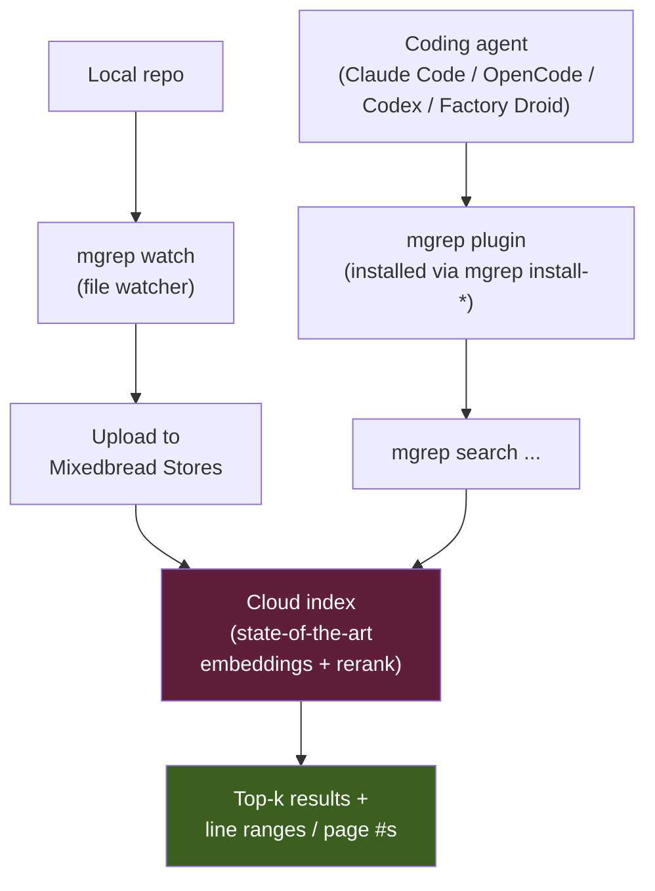

| ✅ Strengths                                                   | ❌ Weaknesses                                |
| -------------------------------------------------------------- | -------------------------------------------- |
| **Semantic search** across code, PDFs, images                  | **Cloud-backed** — files leave your machine  |
| **Multi-modal** — text + images + PDFs in one search           | Requires login + auth (MXBAI_API_KEY for CI) |
| `--agentic` flag for multi-query refinement                    | Network dependent                            |
| **`--web` flag** combines local + web search                   | Privacy concerns for proprietary code        |
| **`--answer` flag** synthesizes responses                      | Indexing latency on first run                |
| Native plugins for Claude Code, OpenCode, Codex, Factory Droid | Pricing for heavy use TBD                    |
| **2× token reduction vs grep** in 50-task Claude Code eval     | Returns ranked results, not workspace        |
| Background indexing via `mgrep watch`                          |                                              |
| Apache-2.0, 4.1k stars, active                                 |                                              |

**Best for**: Daily coding when grep slows down on large codebases. Strong complement to vendored source — vendor for depth, mgrep for fast "where is X?" intent queries. Use with caution on proprietary code due to cloud upload.

---

### 10. Context7

**By**: [Upstash](https://upstash.com/) · **GitHub**: [upstash/context7](https://github.com/upstash/context7) · ~53K stars · ~890K weekly npm downloads

MCP server that fetches up-to-date, version-specific documentation into the agent's context at query time. Registry of 33,000+ libraries indexed via Upstash's proprietary engine.

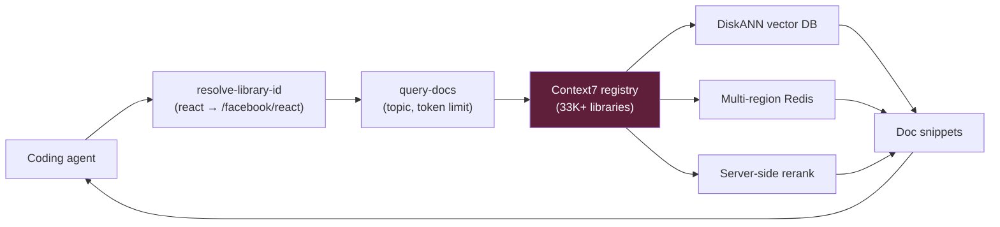

| ✅ Strengths                                | ❌ Weaknesses                                                                                                                      |
| ------------------------------------------- | ---------------------------------------------------------------------------------------------------------------------------------- |
| **Always current** — beats training cutoff  | **Documentation only** — no source code                                                                                            |
| Massive coverage (33K+ libraries)           | Network dependent                                                                                                                  |
| **~65% token reduction** vs naive doc-dumps | **~63% hallucination rate** on bleeding-edge features (vs ~52% for source-indexed tools)                                           |
| Zero repo impact                            | **ContextCrush vulnerability** (Feb 2026) — credential exfil via malicious library submissions; patched but attack surface remains |
| Cross-platform MCP                          | Community-contributed docs with accuracy disclaimers                                                                               |
|                                             | Proprietary backend                                                                                                                |
|                                             | Aggressive free-tier limits                                                                                                        |

**Best for**: Quick lookups of stable, well-documented public APIs. **Complement to vendored source**, not replacement.

---

### 11. RepoSwarm

**GitHub**: [reposwarm/reposwarm](https://github.com/reposwarm/reposwarm) · Apache-2.0 · [blog post](https://robotpaper.ai/reposwarm-give-ai-agents-context-across-all-your-repos/)

AI-powered platform that auto-analyzes entire codebase portfolios and generates standardized `.arch.md` architecture docs. **Multi-repo architecture discovery**, not single-repo context.

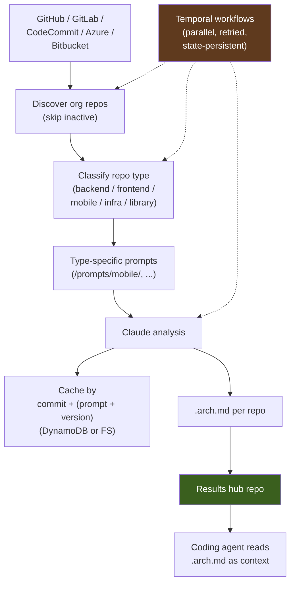

| ✅ Strengths                                  | ❌ Weaknesses                                     |
| --------------------------------------------- | ------------------------------------------------- |
| Built for **org-wide architecture discovery** | **Not real-time** — runs on schedules             |
| **Incremental** — only re-analyzes on changes | **Not MCP yet** — attach `.arch.md` to workspace  |
| Type-aware prompts per repo                   | **Heavy infrastructure** — Docker + Temporal + DB |
| Multi-provider (Anthropic, Bedrock, LiteLLM)  | **Architecture-level only** — no line detail      |
| Prompt dependency chains                      | Claude-dependent (LiteLLM helps)                  |
| Survives multi-hour runs via Temporal         | Read-only analysis                                |

**Best for**: Multi-repo orgs needing portfolio-level architectural context. **Different problem space** from subtree — RepoSwarm provides architectural breadth across many repos; subtree provides source depth in one.

---

### 12. BTCA / BTCA-3

**Site**: [btca.dev](https://btca.dev/) · v1/v2: [davis7dotsh/better-context](https://github.com/davis7dotsh/better-context) (~1.1k stars) · v3 (in dev): [davis7dotsh/btca-3](https://github.com/davis7dotsh/btca-3)

"Better Context App" — **Ask the repo, not the internet.** Clones repos locally, queries them via an AI model (OpenCode in v1/v2, Anthropic Pi Agent SDK in v3). Q&A layer, not direct agent access.

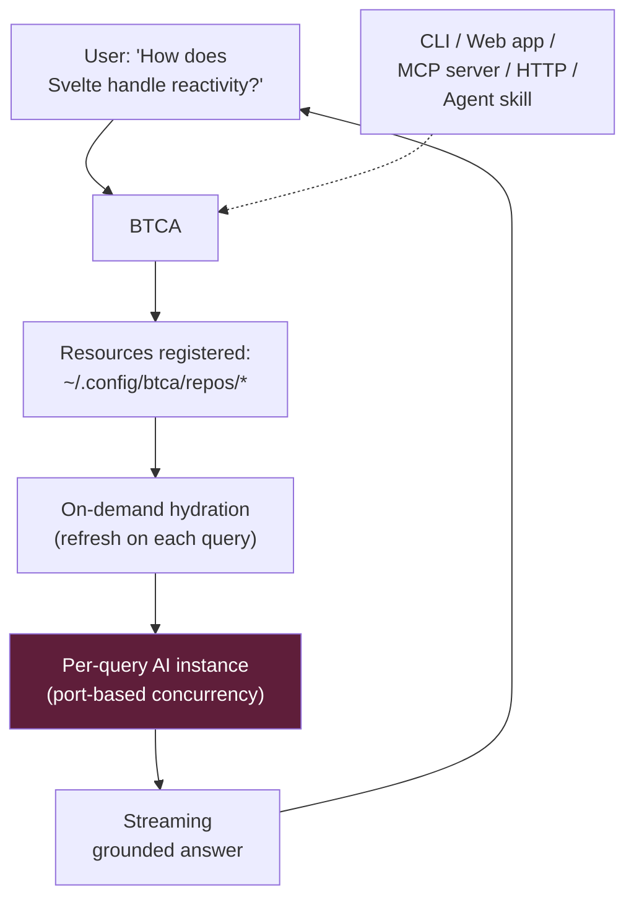

| ✅ Strengths                                     | ❌ Weaknesses                          |
| ------------------------------------------------ | -------------------------------------- |
| Multiple interfaces (CLI, web, MCP, HTTP, skill) | **AI-mediated** — adds latency         |
| Multi-resource queries with `-r` flags           | v1/v2 has stability + Windows issues   |
| Local repo clones                                | v3 not yet production-ready            |
| Skill-based agent integration                    | External AI service dependency         |
| Active dev (v3 in progress)                      | No vector / semantic search — pure LLM |
|                                                  | Each dev clones independently          |

**Best for**: Interactive Q&A research over libraries. Complement to vendored source — BTCA for exploratory questions, subtree for in-IDE coding.

---

### 13. OpenSrc.sh

**Site**: [opensrc.sh](https://opensrc.sh/) · **GitHub**: [vercel-labs/opensrc](https://github.com/vercel-labs/opensrc) · ~1,900 stars · Apache-2.0 · MCP server: [dmmulroy/opensrc-mcp](https://github.com/dmmulroy/opensrc-mcp)

Vercel Labs CLI (Rust core, npm-distributed) that fetches actual source code of third-party deps on demand. Supports npm, PyPI, crates.io, and GitHub/GitLab in one tool.

```bash
opensrc path zod                  # fetch + return local path
opensrc path zod@3.22.0           # version-pinned
opensrc path pypi:requests        # PyPI
opensrc path crates:tokio@1.28.0  # Rust crate
opensrc path owner/repo@ref       # GitHub/GitLab
```

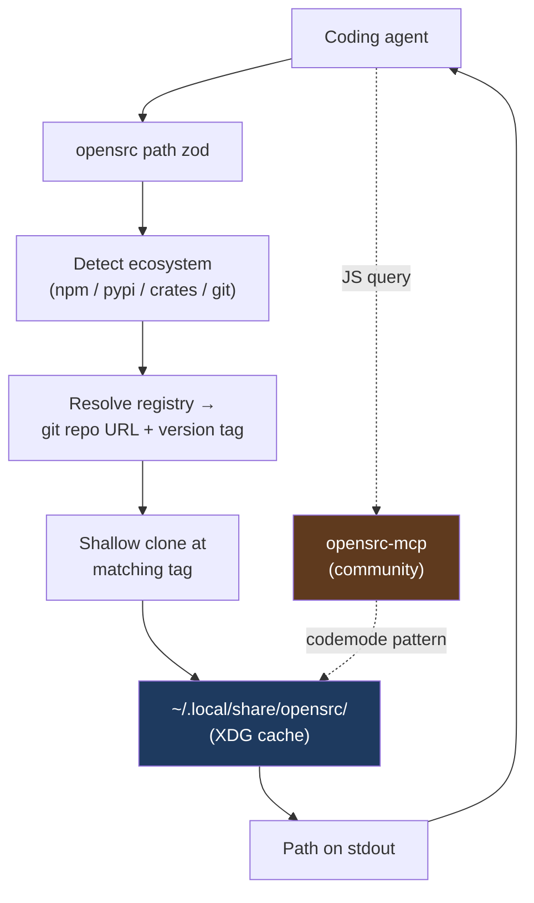

The MCP server's **codemode pattern**: agents write JavaScript that runs server-side against an injected `opensrc` API (`list`, `tree`, `grep`, `astGrep`, `read`, …). Trees stay server-side; only results return to context. Highly token-efficient.

| ✅ Strengths                                     | ❌ Weaknesses                                  |
| ------------------------------------------------ | ---------------------------------------------- |
| **Cross-registry**: npm + PyPI + crates + GitHub | Third-party deps only — not for internal repos |
| **Version-pinned** to installed dep version      | Requires git on system                         |
| Vercel Labs backing                              | MCP is community-maintained, not official      |
| Rust CLI is fast                                 | No semantic search (grep / astGrep only)       |
| **Codemode MCP** keeps trees server-side         | Cache grows with package count                 |
| Global cache shared across projects              |                                                |
| Apache-2.0                                       |                                                |

**Best for**: Letting agents drill into dependency internals without committing them. **Strong complement** to ingraft / Vendir — vendor for repos you constantly touch, OpenSrc for "what does this random npm package do?" exploration.

---

## Subtree-Wrapper Head-to-Head

Three projects wrap `git subtree` for agent vendoring. ingraft is broader than that narrow category, but the comparison is useful because subtree remains its flagship durable-source route.

| Feature                             | Raw `git subtree` | **ingraft** (this project)                      | **Vendir**        |
| ----------------------------------- | ----------------- | ----------------------------------------------- | ----------------- |
| **Strategies**                      | Subtree only      | Subtree + submodule + clone-ignore + cache-link | Subtree only      |
| **Config file**                     | None              | Inferred from git + targets                     | `vendir.toml`     |
| **Package manifest scan**           | ❌                | ✅ — scans `package.json` / lockfiles           | ❌                |
| **Repository aliases**              | ❌                | ✅ — `effect` → `Effect-TS/effect`              | ❌                |
| **Package version sync**            | ❌                | ✅ — `--sync-package <name>`                    | ❌                |
| **File filtering**                  | ❌                | ✅ — ext / dir / globs / size                   | ❌                |
| **Ref / tag / release pinning**     | Manual            | ✅ — `--ref` / `--tag` / `--release`            | Branch only       |
| **`.gitattributes` linguist mgmt**  | ❌                | ✅                                              | ✅                |
| **IDE excludes (VS Code / Cursor)** | ❌                | ✅                                              | ✅ (VS Code)      |
| **Repair command**                  | ❌                | `doctor --fix`                                  | `doctor --fix`    |
| **Monorepo support**                | ❌                | ✅ — 13 build systems                           | ❌                |
| **Optional context-tool routing**   | ❌                | ✅ — Repomix / OpenSrc / Repobase               | ❌                |
| **Agent skill distribution**        | ❌                | ✅ — `ingraft`                                  | ❌                |
| **History-rewrite removal**         | Manual            | `--dangerously-rewrite-history`                 | ❌                |
| **Cloudflare artifact**             | ❌                | ✅                                              | ❌                |
| **Language / runtime**              | Git               | TypeScript + Effect-TS (Node)                   | TypeScript (Node) |
| **License**                         | —                 | MIT                                             | MIT               |
| **Created**                         | —                 | 2026                                            | 2026-05-12        |

**TL;DR**:

- **Raw `git subtree`** — fine if you know exactly what to vendor and don't care about hygiene
- **ingraft** — full-featured: multi-strategy, manifest scanning, monorepo-aware, ships as agent skill
- **Vendir** — minimal and focused: ergonomic subtree-only wrapper with TOML config

---

## Full Comparison Matrix

| Feature                        | Raw Subtree | ingraft | Vendir | Submodule | Clone | Skills   | Repomix   | Repobase   | mgrep        | Context7                      | RepoSwarm  | BTCA/3         | OpenSrc     |
| ------------------------------ | ----------- | ------- | ------ | --------- | ----- | -------- | --------- | ---------- | ------------ | ----------------------------- | ---------- | -------------- | ----------- |
| **Source available**           | Full        | Full    | Full   | Full\*    | Full  | ❌       | Flattened | File reads | Snippets     | ❌ (docs)                     | Summaries  | Clones         | Full        |
| **Native file tools**          | ✅          | ✅      | ✅     | ✅\*      | ✅    | N/A      | ❌        | via MCP    | via plugin   | ❌                            | ❌         | via AI         | ✅          |
| **Cross-file imports**         | ✅          | ✅      | ✅     | ✅\*      | ✅    | ❌       | Partial   | via MCP    | ❌           | ❌                            | ❌         | via AI         | ✅          |
| **Works offline**              | ✅          | ✅      | ✅     | ✅\*      | ✅    | ✅       | ✅        | ✅         | ❌           | ❌                            | ❌         | Partial        | After fetch |
| **Committed to host**          | ✅          | ✅      | ✅     | Pointer   | ❌    | ✅       | Optional  | ❌         | ❌           | ❌                            | Docs repo  | ❌             | ❌          |
| **Repo size impact**           | High        | High    | High   | Low       | None  | None     | Low       | None       | None         | None                          | None       | None           | None        |
| **Multi-strategy**             | ❌          | ✅ (4)  | ❌     | —         | —     | —        | —         | —          | —            | —                             | —          | —              | —           |
| **Manifest scan**              | ❌          | ✅      | ❌     | ❌        | ❌    | ❌       | ❌        | ❌         | ❌           | ❌                            | Org repos  | ❌             | ❌          |
| **Setup complexity**           | Low         | Low     | Low    | Medium    | Low   | Low      | Low       | Medium     | Low (+ auth) | Low                           | **High**   | Medium         | Low         |
| **Works with any agent**       | ✅          | ✅      | ✅     | Partial   | ✅    | Standard | ✅        | MCP        | Plugins      | MCP                           | Custom     | Multi          | CLI / MCP   |
| **Network at runtime**         | ❌          | ❌      | ❌     | ❌        | ❌    | ❌       | ❌        | ❌         | ✅           | ✅                            | ✅         | ✅             | At fetch    |
| **Privacy** (code stays local) | ✅          | ✅      | ✅     | ✅        | ✅    | ✅       | Optional  | ✅         | **❌**       | ✅                            | depends    | depends        | ✅          |
| **Skill-distributed**          | ❌          | ✅      | ❌     | ❌        | ❌    | Self     | Generator | ❌         | Plugins      | ❌                            | ❌         | ✅             | ❌          |
| **Open source**                | Git         | MIT     | MIT    | Git       | Git   | Standard | MIT       | MIT        | Apache-2.0   | Apache-2.0 / proprietary core | Apache-2.0 | MIT            | Apache-2.0  |
| **Cost**                       | Free        | Free    | Free   | Free      | Free  | Free     | Free      | Free       | Freemium     | Free + paid                   | Free + LLM | Freemium + LLM | Free        |

_\* Only if submodule is properly initialized — many agents fail at this step._

---

## When to Use What

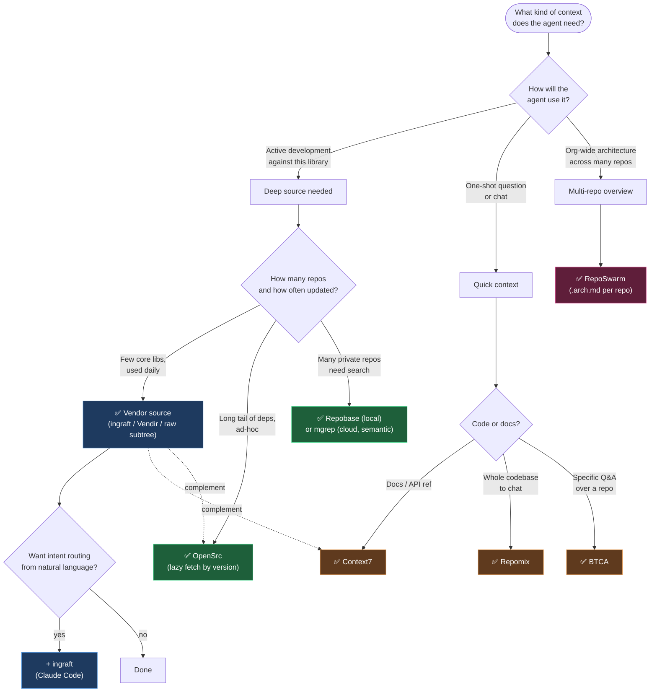

### Quick reference

| Your situation                                                 | Use                                     |
| -------------------------------------------------------------- | --------------------------------------- |
| Daily coding with one or a few key libraries                   | **ingraft** (or Vendir, or raw subtree) |
| Want the agent to choose a context route from natural language | **ingraft** + agent skill               |
| Need latest API docs across many libraries                     | **Context7** (complement, not replace)  |
| Quick one-shot question / chat-based AI                        | **Repomix**                             |
| Search across many private repos, offline                      | **Repobase**                            |
| Fast semantic "where is X?" across a codebase                  | **mgrep** (if cloud upload is OK)       |
| Inspect a random npm/PyPI/crates package                       | **OpenSrc**                             |
| Ad-hoc Q&A research over a specific repo                       | **BTCA**                                |
| Org-wide architecture context across N repos                   | **RepoSwarm**                           |
| Team needs shared, reproducible context                        | Subtree wrapper (committed)             |
| Just need to tell the agent conventions                        | **Skills** (with one of the above)      |

---

## The Optimal Stack

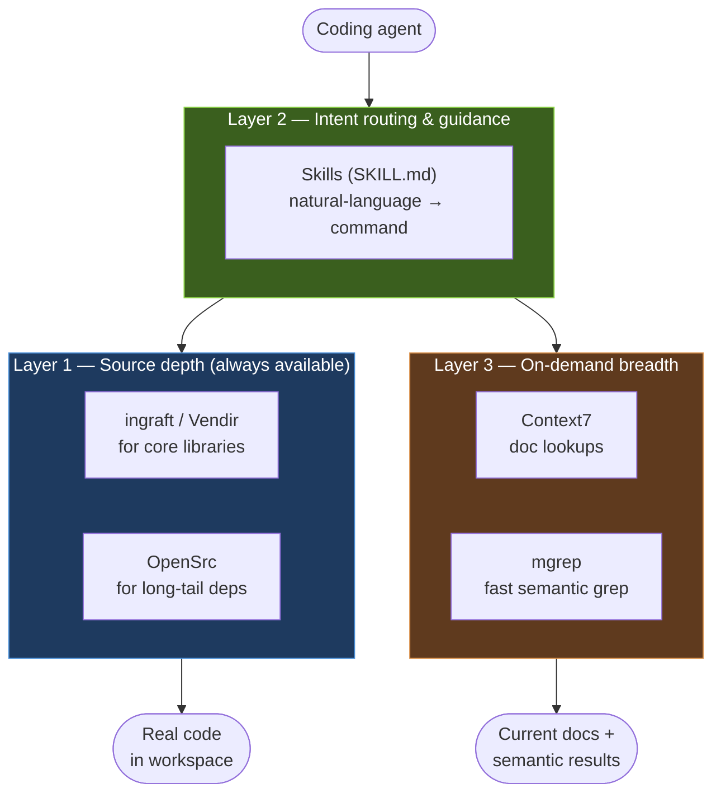

- **Depth** — full source for libraries you use heavily
- **Direction** — skills route the agent's intent to the right tool
- **Breadth** — on-demand docs + semantic search for everything else

---

## Why Effect Chose Subtree

In [their blog post](https://effect.website/blog/the-one-weird-git-trick-that-makes-coding-agents-more-effect-ive/) (May 2026), Maxwell Brown (Founding Engineer at Effect) laid out the case for git subtree as the best method for providing library context to coding agents.

> **Important caveat**: Effect's conclusions are based on **qualitative experience**, not formal benchmarks. There are no published metrics or A/B tests. The reasoning is experiential — but architecturally sound and aligns with how coding agents actually work.

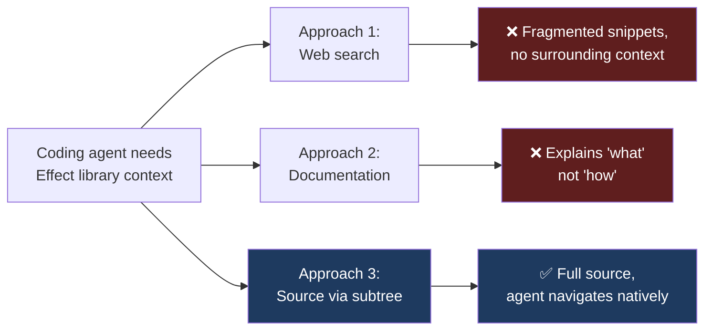

### Why subtree, not submodule by default

| Factor           | Submodule (rejected)             | Subtree (recommended)               |
| ---------------- | -------------------------------- | ----------------------------------- |
| Clone behavior   | Requires explicit initialization | Works automatically                 |
| Indirection      | Adds a layer                     | Behaves like regular folders        |
| Metadata         | Requires `.gitmodules`           | No extra metadata                   |
| Agent visibility | Extra steps for agent            | Indistinguishable from project code |

Submodules become the better choice when the parent repository must commit an
editable gitlink. Otherwise, keep `vendor/` read-only and use `ingraft fork` to
place the editable fork checkout beside the host repo while agents read the
vendor projection.

### Effect's key arguments

1. **Agents are code-readers, not doc-readers**. Agents are "substantially less effective when working from documentation written for humans."
2. **Source code is navigable**. Agents can "explore the actual implementation … just like any other part of your project."
3. **No moving parts**. No network, no embeddings, no retrieval variance.
4. **Reproducible** across environments — committed to the host repo.
5. **The quality improvement justifies the cost** of repo size and maintenance.

### Effect's recommended setup

- `git subtree add --prefix=repos/<lib> <url> <branch> --squash`
- Hide vendored code from human developers via IDE excludes (TS auto-imports, file explorer, search)
- Guide agents via AGENTS.md: treat vendored repos as read-only, prefer their patterns, never modify, never import in app code
- Optionally create pattern files that capture discovered idioms

---

## Key Takeaways

1. **For deep dependency work, vendored source is the gold standard.** The Effect team's argument — agents read code better than docs — is architecturally sound. Whether you use raw `git subtree`, **ingraft**, or **Vendir**, the underlying win is the same: navigable source in the workspace.

2. **The route choice matters more than the tool label.** Pick ingraft when you want manifest scanning, version sync, multiple durable-source strategies, optional context-tool wrappers, monorepo hygiene, and agent-skill routing. Pick Vendir for a minimal subtree-only wrapper with TOML config.

3. **No single approach covers everything.** Combine layers: subtree for depth, OpenSrc for the long tail, Context7 / mgrep for on-demand breadth, Skills for intent routing.

4. **Static snapshots are good for chat, weaker for agents.** Repomix and BTCA shine for one-shot context — but for ongoing agentic development, a navigable workspace beats a flattened artifact.

5. **Submodules are not the default, but they have one strong job.** For read-only agent context, the initialization step is a reliability killer, so use subtree or cache-linked projections. For editable upstream work, prefer `ingraft fork` unless the parent repo specifically needs to commit a submodule pointer.

6. **Retrieval-based tools trade depth for convenience.** Watch for failure modes: Context7's hallucination rate on bleeding-edge features (~63%) and ContextCrush incident; Repobase's early-stage maturity; mgrep's cloud-upload privacy posture; BTCA's AI-mediation latency.

7. **The landscape is moving fast.** ingraft, Vendir, mgrep, BTCA-3, OpenSrc, and the async cloud-agent products are all young or recently rebuilt. Expect more tooling. The durable insight is broader than vendoring: **agents work best when the route to context is explicit, inspectable, and aligned with the task's authority boundary**.

---

## References

- [Effect blog: The One Weird Git Trick That Makes Coding Agents More Effect-ive](https://effect.website/blog/the-one-weird-git-trick-that-makes-coding-agents-more-effect-ive/) — Maxwell Brown, May 2026
- [ingraft](https://www.npmjs.com/package/ingraft) (this project)
- [Vendir](https://github.com/grovemotorco/vendir)
- [Repomix](https://repomix.com/) · [GitHub](https://github.com/yamadashy/repomix)
- [Repobase](https://github.com/fernandoabolafio/repobase)
- [mgrep](https://github.com/mixedbread-ai/mgrep) · [demo](https://demo.mgrep.mixedbread.com)
- [Context7](https://github.com/upstash/context7) · [ContextCrush writeup](https://chatforest.com/reviews/context7-mcp-server/)
- [RepoSwarm](https://github.com/reposwarm/reposwarm) · [Blog](https://robotpaper.ai/reposwarm-give-ai-agents-context-across-all-your-repos/)
- [BTCA / better-context](https://github.com/davis7dotsh/better-context) · [BTCA-3](https://github.com/davis7dotsh/btca-3)
- [OpenSrc](https://github.com/vercel-labs/opensrc) · [opensrc-mcp](https://github.com/dmmulroy/opensrc-mcp)
- [Agent Skills standard](https://agentskills.io/specification)
- [Claude Code Skills docs](https://code.claude.com/docs/en/skills)

---

_Last updated: 2026-05-13_
_Based on Effect team's qualitative recommendation and independent technical research across all listed tools._
