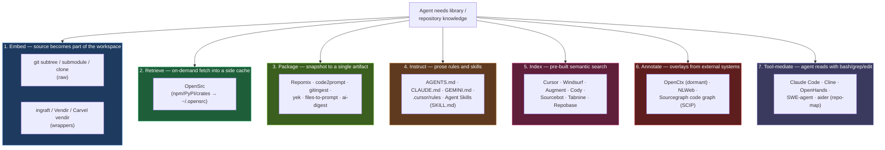
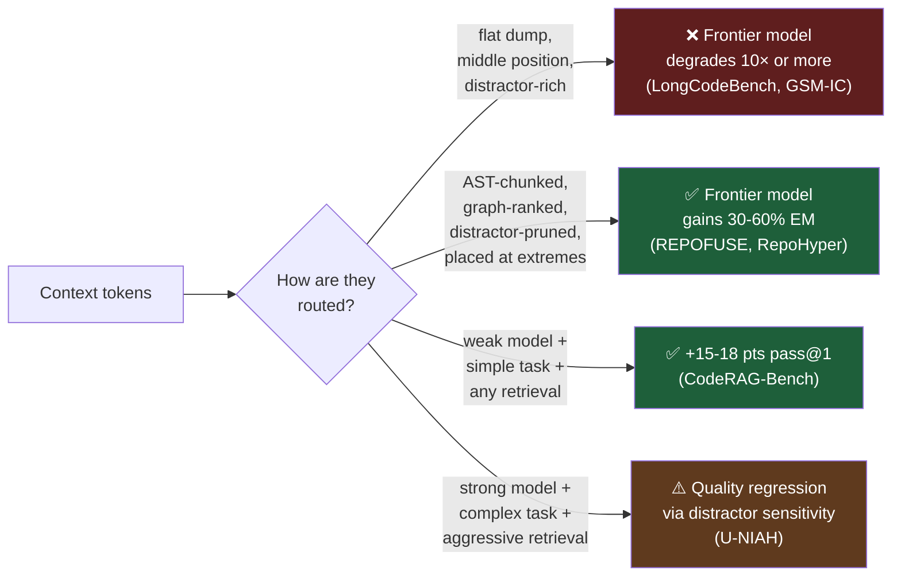
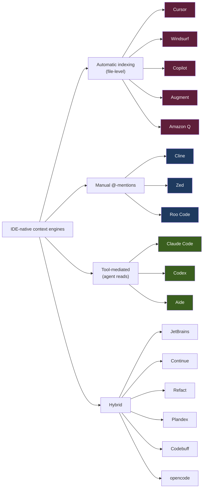
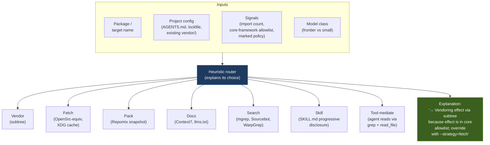
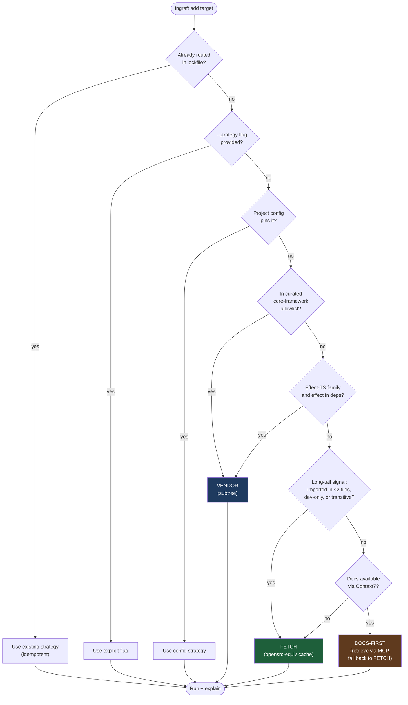
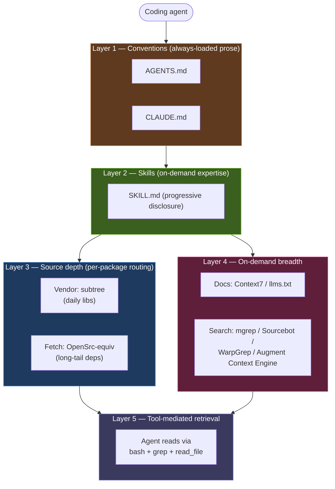

import { Aside, Tabs, TabItem, Badge, LinkCard, CardGrid } from "@astrojs/starlight/components"

# Context Engineering for AI Coding Agents

> A 2026 whitepaper synthesizing peer-reviewed research, frontier-lab engineering blogs, practitioner essays, industry surveys, and a complete inventory of the tooling landscape — toward an empirically-defensible thesis for how coding agents should consume repository and library knowledge.

**Last updated:** 2026-05-13 · **Status:** v1 · **License:** [CC BY 4.0](https://creativecommons.org/licenses/by/4.0/)

---

## Abstract

By mid-2026, "context engineering" has emerged as a discipline distinct from prompt engineering ([Anthropic, Sept 2025](https://www.anthropic.com/engineering/effective-context-engineering-for-ai-agents)). For coding agents — Claude Code, Cursor, Copilot, Cline, aider, Codex, and a long tail of others — the question of **how to feed library and repository knowledge** to the model has become the most consequential design decision in the entire stack. Empirical work shows frontier 1M-context models still collapse on real software tasks at scale ([LongCodeBench](https://arxiv.org/abs/2505.07897); [Chroma Context Rot](https://research.trychroma.com/context-rot)). Practitioner experience converges on a strikingly small set of high-signal strategies — vendoring, retrieval-by-tool-use, progressive-disclosure skills, and pre-built semantic indices — each of which wins decisively in *some* settings and fails badly in others.

This whitepaper argues that no single strategy is correct in general. The right operational frame is a **context router**: a small piece of explicit logic that, given a project and a target library or query, chooses among (a) vendoring source into the workspace, (b) on-demand fetching from package registries, (c) curated doc retrieval, (d) semantic search, (e) prose rules / skills, and (f) tool-mediated agentic search — and explains its choice. We ground this thesis in 35+ academic papers, 60+ tools surveyed in May 2026, the leading practitioner writing, and the emerging standards landscape (MCP, AGENTS.md, Agent Skills, llms.txt) governed by the Linux Foundation's Agentic AI Foundation.

We close by mapping the design space for a router implementation, identifying open problems (model-aware routing, privacy-preserving retrieval, supply-chain trust for skill discovery), and pointing to the empirical questions that the field is closest to answering.

---

## 1. Introduction

### 1.1 Why this matters in 2026

Adoption of AI coding agents is now broad and uneven. **84%** of Stack Overflow respondents report using or planning to use AI tools ([Stack Overflow 2025 Survey](https://survey.stackoverflow.co/2025/ai/)); **85%** of developers use AI tools "regularly" per JetBrains ([State of the Developer Ecosystem 2025](https://devecosystem-2025.jetbrains.com/artificial-intelligence)). Yet trust is collapsing — Stack Overflow's positive-sentiment score fell from 70%+ in 2023–2024 to **60%** in 2025, and only **29%** of respondents say they trust AI, down 11 points year-over-year. **45%** of developers say they spend more time debugging AI-generated code than they save initially (JetBrains).

The mechanism behind that gap is well-characterized: **context quality, not raw model capability, is the dominant variable** in coding-agent success on real-world tasks ([Anthropic's 49% on SWE-bench Verified with "minimal scaffolding"](https://www.anthropic.com/research/swe-bench-sonnet); [Agentless 32% at $0.70/issue](https://arxiv.org/abs/2407.01489); [Devin's 67% PR merge rate vs 34% prior year](https://cognition.ai/blog/devin-annual-performance-review-2025)). Improving an agent's success rate at frontier model scale is no longer about better models — it is about feeding those models the *right* tokens, in the *right* position, *bounded* below the model's real attention-effective window.

This whitepaper is the synthesis we wish existed in May 2026 when starting work on the next iteration of [`ingraft`](https://ingraft.dev/), an open-source CLI for routing per-package context strategies.

### 1.2 What we cover

- **§2 — A taxonomy of context strategies.** Embed / Retrieve / Package / Instruct / Index / Annotate / Tool-mediated. Each with one canonical realization and known trade-offs.
- **§3 — The empirical case.** 35+ peer-reviewed papers organized around the four critical findings (Lost-in-the-Middle, Context Rot, Repo-level retrieval, Distraction).
- **§4 — The practitioner consensus.** Effect, Anthropic, Cursor, Cline, aider, OpenHands, Devin, Sourcegraph, plus 2025/2026 surveys. Verbatim quotes throughout.
- **§5 — The tool landscape, May 2026.** A complete catalog of 60+ tools across IDE-native, code search, repo packaging, MCP servers, embeddings, and multi-repo systems.
- **§6 — Standards & protocols.** MCP, A2A, ACP, AGENTS.md, Agent Skills, CLAUDE.md/GEMINI.md, llms.txt, SCIP, OpenCtx, plus the Linux Foundation Agentic AI Foundation.
- **§7 — The context router thesis.** Synthesis of §2–§6 into operational rules, with decision-tree and architecture diagrams.
- **§8 — Open problems and future work.**

### 1.3 What this whitepaper is *not*

It is not a Claude Code/Cursor head-to-head; product-grade benchmarking moves faster than any whitepaper can track. It is not a tutorial; it assumes baseline familiarity with concepts like RAG, MCP, and `git subtree`. It is not neutral on every question — the synthesis takes positions where the evidence supports them, and flags conflicts where it does not.

---

## 2. A Taxonomy of Context Strategies

Every approach for getting external knowledge in front of a coding agent reduces to one of seven primitives, often used in combination.

| Primitive | Latency | Repo-size impact | Privacy | Signal density | Reproducible |
|---|---|---|---|---|---|
| **Embed** (subtree) | none (offline) | high | local | high (full source) | yes (committed) |
| **Retrieve** (OpenSrc) | low (one fetch) | none (XDG cache) | local | high (full source) | per-version |
| **Package** (Repomix) | low | low (single file) | local | medium (flattened) | static snapshot |
| **Instruct** (Skills) | very low | low | local | low (prose) | yes |
| **Index** (Cursor) | low (cached) | low | varies | medium (snippets) | drifts |
| **Annotate** (OCG) | medium (live) | none | varies | low–medium (overlays) | live |
| **Tool-mediate** (CC) | high (LLM loop) | none | local | high (selective) | non-deterministic |

These primitives compose. Anthropic's recommended Claude Code setup combines **Instruct** (CLAUDE.md), **Tool-mediate** (bash + grep + read), **Skill** (progressive disclosure SKILL.md), and **Retrieve** via MCP. Cursor combines **Index** (default), **Retrieve** (`@docs`), and **Instruct** (`.cursor/rules`). Effect's `git subtree` recommendation is pure **Embed**, leveraging the agent's **Tool-mediate** capability over the embedded source.

The **operational question** every team faces is not which primitive is best — it is *which primitive to use for which library, in which task, at which moment in the agent's loop.* That is the question this whitepaper exists to answer.

---

## 3. The Empirical Case

We organize 35+ papers around four pillars: **(A)** long-context degrades empirically on real code, **(B)** retrieval helps unevenly and can hurt, **(C)** structural primitives beat flat lexical retrieval, **(D)** distractor sensitivity is a first-class failure mode. Each pillar carries one core implication for routing.

### 3.1 Pillar A — Long Context Degrades on Real Code

<Aside type="caution" title="Headline result">
**LongCodeBench (May 2025):** Claude 3.5 Sonnet drops from **29% to 3%** between 32K and 1M token contexts on GitHub-issue resolution. Qwen2.5 drops from **70.2% to 40%**. The drop is monotonic and universal across frontier models tested. ([Anonymous, 2505.07897](https://arxiv.org/abs/2505.07897))
</Aside>

**[Lost in the Middle](https://arxiv.org/abs/2307.03172)** (Liu et al., TACL 2024) established the canonical U-shape: "performance is often highest when relevant information occurs at the beginning or end of the input context, and significantly degrades when models must access relevant information in the middle." The mechanism is well-replicated across model families.

**[RULER](https://arxiv.org/abs/2404.06654)** (NVIDIA, COLM 2024) showed that advertised context windows are not the same as effective context windows. Even models scoring near-perfect on the original Needle-in-a-Haystack synthetic task degrade sharply on multi-hop variations: "almost all models exhibit large performance drops as the context length increases" — only half maintain satisfactory performance at 32K.

**[Chroma Context Rot](https://research.trychroma.com/context-rot)** (Hong et al., July 2025) tested 18 frontier models and identified three compounding mechanisms: lost-in-the-middle, attention dilution, and distractor interference. *Every model degraded at every length increment.*

For code specifically, **[LongCodeBench](https://arxiv.org/abs/2505.07897)** and **[LoCoBench](https://arxiv.org/abs/2509.09614)** translate these findings into the software-engineering setting. The headline numbers above are not an artifact of synthetic benchmarks — they reproduce on real GitHub issues with executable patch generation.

> "Long-context remains a weakness for all models." — LongCodeBench, May 2025

**Routing implication.** The naive answer to "should we just stuff everything into the 1M-token window?" is *no*. The router must operate inside a budget bounded by the model's **RULER-effective length**, not its advertised length — typically 32K–64K for current frontier models on real code workloads.

### 3.2 Pillar B — Retrieval Helps Unevenly and Can Hurt

**[CodeRAG-Bench](https://arxiv.org/abs/2406.14497)** (Wang et al., NAACL Findings 2025) is the seminal empirical study of retrieval-augmented code generation. Across 8 tasks and 5 corpora:

> "RACG significantly benefits weaker code generation models such as StarCoder2-7B, particularly on basic programming tasks like HumanEval and MBPP, with gains of 15.6–17.8 percentage points... but retrieval performance is limited on more challenging tasks like DS-1000, ODEX and SWE-Bench."

**[U-NIAH](https://arxiv.org/abs/2503.00353)** (ACM TOIS 2025) makes the conflict explicit:

> "RAG significantly enhances smaller LLMs by mitigating the 'lost-in-the-middle' effect... achieving an 82.58% win-rate. However, advanced reasoning LLMs exhibit reduced RAG compatibility due to sensitivity to semantic distractors."

**[Self-RAG](https://arxiv.org/abs/2310.11511)** (Asai et al., ICLR 2024) advances the operational fix:

> "Indiscriminately retrieving and incorporating a fixed number of retrieved passages... diminishes LM versatility or can lead to unhelpful response generation."

The solution Self-RAG demonstrates — adaptive on-demand retrieval driven by reflection tokens — is the architectural precedent for what Anthropic later called "just-in-time" context engineering.

**Routing implication.** Retrieval is **not always beneficial**. The router must consider model strength × task complexity. Frontier reasoning models on hard tasks can be *harmed* by aggressive retrieval; weaker models on simple tasks gain double-digit pass-rate. The router cannot be one-size-fits-all.

### 3.3 Pillar C — Structural Retrieval Beats Flat Lexical

A line of repository-level work consistently shows that **graphs and AST** beat flat embedding retrieval:

- **[RepoCoder](https://arxiv.org/abs/2303.12570)** (EMNLP 2023) introduced iterative retrieve-then-generate over repo-level context. +10% over in-file baseline.
- **[RepoFusion](https://arxiv.org/abs/2306.10998)** (ServiceNow / Mila 2023) used Fusion-in-Decoder over imports / parent classes / similar-named files — "even though these models struggle to understand repository-level context (e.g., imports, parent classes), structured priors close the gap."
- **[CoCoMIC](https://arxiv.org/abs/2212.10007)** (AWS, LREC-COLING 2024) used a static-analysis-driven project context graph. **33.94%** relative gain in exact match when cross-file context is included.
- **[CrossCodeEval](https://arxiv.org/abs/2310.11248)** (NeurIPS 2023 D&B) is the benchmark designed to be unsolvable from in-file context alone — providing the cleanest evidence that single-file context is provably inadequate.
- **[RepoHyper](https://arxiv.org/abs/2403.06095)** (FORGE 2025) titled bluntly: *"Better Context Retrieval Is All You Need for Repository-Level Code Completion."* GNN-based reranking over a Repo Semantic Graph outperformed all flat-retrieval baselines.
- **[REPOFUSE](https://arxiv.org/abs/2402.14323)** (Ant Group CodeFuse) coined the **"Context-Latency Conundrum"** and fused analogy + rationale contexts with rank truncation. 40.90–59.75% EM gain on CrossCodeEval **and** 26.8% inference speedup.
- **[cAST](https://arxiv.org/abs/2506.15655)** (CMU, June 2025) provided the missing peer-reviewed evidence for AST-aware chunking: +5.5 points on RepoEval, +4.3 on CrossCodeEval, +2.7 on SWE-bench versus line-based chunking. This is the academic citation for Repomix's tree-sitter compression strategy.
- **[GraphCoder](https://arxiv.org/abs/2406.07003)** (ASE 2024) explicitly fused control-flow and data-flow.
- **[Code-Craft](https://arxiv.org/abs/2504.08975)** (April 2025) hierarchical-graph summarization showed **82%** relative improvement in top-1 retrieval precision for `libsignal`.

**Routing implication.** When the router chooses an indexing strategy, **AST + graph** beats raw embeddings. The router should expose both — but graph-aware retrieval should be the default for non-trivial code workloads.

### 3.4 Pillar D — Distractor Sensitivity

**[Large Language Models Can Be Easily Distracted by Irrelevant Context](https://arxiv.org/abs/2302.00093)** (Shi et al., ICML 2023) introduced GSM-IC, showing that "model performance is dramatically decreased when irrelevant information is included." This is the foundational negative-result anchor for the entire "more context isn't always better" argument.

**[GSM-DC](https://arxiv.org/abs/2505.18761)** (May 2025) extended GSM-IC to multi-step reasoning: "LLMs are significantly sensitive to irrelevant context, affecting both reasoning path selection and arithmetic accuracy."

**[Found in the Middle](https://arxiv.org/abs/2406.16008)** showed positional attention calibration can recover middle-context utilization — but for now, the operational answer is "place high-priority context at the extremes."

**Routing implication.** *Adding* context can hurt. Quality dominates quantity. The router should optimize for **smallest sufficient context**, not maximum context.

### 3.5 Synthesis of the empirical evidence

The empirical evidence does **not** support any single context strategy as dominant. It supports **routing** as a design pattern: *the right context, at the right position, bounded under the model's effective length, with model-aware and task-aware policies.*

---

## 4. The Practitioner Consensus

We canvassed the engineering blogs, podcasts, and HN/Reddit threads of the leading frontier labs and tool builders. Five strong perspectives have emerged, often disagreeing sharply with one another. We quote verbatim where we have the primary source.

### 4.1 The vendor-source camp (Effect, Geoffrey Huntley)

**[Maxwell Brown — "The One Weird Git Trick That Makes Coding Agents More Effect-ive"](https://effect.website/blog/the-one-weird-git-trick-that-makes-coding-agents-more-effect-ive/)** (Effect blog, May 11, 2026):

> "Coding agents rely on patterns and examples, not descriptions."
>
> Agents are "substantially less effective when working from documentation written for humans."
>
> "Give your agent real library code to learn from."
>
> "Coding agents are actually good at: reading and exploring code. When source code is available, an agent can explore it the way it was designed to: by following usage patterns, tracing abstractions, and learning from existing patterns."

Brown's critique of alternatives:
- web search: "token inefficient" with "highly fragmented context";
- node_modules: "often compiled or flattened, losing the structure and comments that make source navigable";
- documentation: "written for humans, not agents."

The recommended setup is `git subtree add --prefix=repos/<lib> <url> <branch> --squash` plus IDE excludes (to hide the noise from human developers) and AGENTS.md guidance ("treat vendored repos as read-only, prefer their patterns, never import in app code").

**Geoffrey Huntley — ["Everything is a Ralph Loop"](https://ghuntley.com/loop/)** (Jan 17, 2026):

> "Ralph is about getting the most out how the underlying models work through context engineering and that pattern is GENERIC and can be used for ALL TASKS."
>
> "It's not that hard to build a coding agent. 300 lines of code running in a loop with LLM tokens."

The vendor-source camp's strongest empirical anchor: the **agent reads code better than docs** — a thesis that the Anthropic team independently confirmed (§4.2).

### 4.2 The agentic-search camp (Anthropic, Cline)

**Boris Cherny (Anthropic, creator of Claude Code) on the [Latent Space podcast](https://www.latent.space/p/claude-code)** (May 7, 2025):

> "Early versions of Claude Code used RAG + a local vector db, but we found pretty quickly that agentic search generally works better. It is also simpler and doesn't have the same issues around security, privacy, staleness, and reliability."
>
> "It outperformed everything. By a lot... agentic search just sidesteps all of that [security issues]. So essentially, at the cost of latency and tokens, you now have really awesome search without security downsides."
>
> "Claude Code is not a product as much as it's a Unix utility."

**[Catherine Wu (Anthropic, PM Claude Code) on the Every podcast](https://every.to/podcast/transcript-how-to-use-claude-code-like-the-people-who-built-it)** (Oct 29, 2025):

> "[Vector DBs are] really tricky to maintain because you have to continuously re-index the code and they might get out of date and you have local changes... Claude models are really good at agentic search. You can get to the same accuracy level with agentic search and it's just a much cleaner deployment story."

**[Nick Baumann / Cline — "Why Cline Doesn't Index Your Codebase (And Why That's a Good Thing)"](https://cline.bot/blog/why-cline-doesnt-index-your-codebase-and-why-thats-a-good-thing)** (May 27, 2025):

> "We don't index your codebase, and this choice isn't an oversight, it's a fundamental design decision that delivers better code quality, stronger security, and more reliable results."
>
> "Imagine trying to understand a symphony by listening to random 10-second clips. That's what RAG does to your codebase."
>
> "An index, by definition, is a snapshot frozen in time. The code inevitably drifts out of sync."
>
> "Your codebase isn't just text — it's your competitive advantage. When you create vector embeddings, you're creating a secondary representation of your most valuable IP that needs to be stored somewhere."

**[Anthropic — "Raising the Bar on SWE-bench Verified with Claude 3.5 Sonnet"](https://www.anthropic.com/research/swe-bench-sonnet)**:

> "Give as much control as possible to the language model itself, and keep the scaffolding minimal."

The agentic-search camp wins **49% on SWE-bench Verified with just bash + edit tools** — a striking result for "no retrieval pipeline."

### 4.3 The pre-indexed camp (Cursor, Augment, Sourcegraph Amp)

**[Cursor — "Securely Indexing Large Codebases"](https://cursor.com/blog/secure-codebase-indexing)** (Jan 27, 2026):

> "Cursor builds its first view of a codebase using a Merkle tree, which lets it detect exactly which files and directories have changed without reprocessing everything."
>
> "Clones of the same codebase average 92% similarity across users within an organization."
>
> Cursor reports "Semantic search is a major driver of agent performance, improving response accuracy by 12.5% on average."

HN response, *electroly* on the Cline anti-indexing post ([id=44106944](https://news.ycombinator.com/item?id=44106944)):

> "Codebase indexing is still a killer feature in Cursor. I have tens of thousands of reference files stashed in the project directory to be indexed so that any time the model reaches out to the codebase search tool with a question, it finds a file with the answer."

**Augment Context Engine** reports a **70%+** agent improvement when piping its 400k-file semantic index into Claude Code / Cursor / Codex over MCP ([docs.augmentcode.com](https://docs.augmentcode.com/context-services/mcp/overview)). **Sourcegraph Amp** continues to bet on SCIP-backed graph context across very large codebases; Quinn Slack and Beyang Liu spun Amp out as an independent company in December 2025 specifically to chase the "frontier coding agent" market with deep code-graph context.

The pre-indexed camp wins on scale. For organizations with 10K+ files where `ripgrep` becomes a context-budget catastrophe, the indexed approaches have measurable wins.

### 4.4 The repo-map middle-way (aider)

**[Paul Gauthier — "Building a Better Repository Map with Tree-Sitter"](https://aider.chat/2023/10/22/repomap.html)**:

> "Sending whole files is a bulky way to send code context, wasting the precious context window."
>
> "The map is richer, showing full function call signatures and other details straight from the source files."

aider's `--map-tokens` (default 1K) packs a tree-sitter-derived PageRank summary of classes/functions/signatures into a tiny fraction of the context. The aider polyglot leaderboard remains one of the most rigorous comparative benchmarks for coding-edit quality.

### 4.5 The skills-and-rules camp (Anthropic, agentskills.io, HumanLayer)

**[Anthropic — "Equipping Agents for the Real World with Agent Skills"](https://www.anthropic.com/engineering/equipping-agents-for-the-real-world-with-agent-skills)** (Oct 16, 2025):

> "Like a well-organized manual that starts with a table of contents, then specific chapters, and finally a detailed appendix, skills let Claude load information only as needed."

**[Simon Willison — "Claude Skills are awesome, maybe a bigger deal than MCP"](https://simonwillison.net/2025/Oct/16/claude-skills/)** (Oct 16, 2025):

> "Skills are Markdown with a tiny bit of YAML metadata and some optional scripts."
>
> "Each skill only takes up a few dozen extra tokens, with the full details only loaded in should the user request."
>
> "GitHub's official MCP on its own famously consumes tens of thousands of tokens of context. I can drop a Markdown file in describing how to do a task instead, without implementing a new CLI tool."
>
> "I expect we'll see a Cambrian explosion in Skills which will make this year's MCP rush look pedestrian."

**[Kyle / HumanLayer — "Writing a Good CLAUDE.md"](https://www.humanlayer.dev/blog/writing-a-good-claude-md)** (Nov 25, 2025):

> "Frontier thinking LLMs can follow ~ 150-200 instructions with reasonable consistency."
>
> "General consensus is that &lt; 300 lines is best."
>
> "Don't try to stuff every command Claude could possibly need to run in your CLAUDE.md file — you will get sub-optimal results."

**[Kyle / HumanLayer — "Skill Issue: Harness Engineering for Coding Agents"](https://www.humanlayer.dev/blog/skill-issue-harness-engineering-for-coding-agents)** (March 12, 2026):

> "Performance degrades as context length increases — even on simple tasks."
>
> "If you're not actively using a server which provides a large number of tools, turn it off."
>
> "Less (instructions) is more."

### 4.6 The context-engineering-as-discipline camp (Anthropic, Thomas Ptacek, Armin Ronacher)

**[Anthropic — "Effective Context Engineering for AI Agents"](https://www.anthropic.com/engineering/effective-context-engineering-for-ai-agents)** (Sept 29, 2025) is the closest thing to a manifesto for this whitepaper's thesis:

> "Context engineering refers to the set of strategies for curating and maintaining the optimal set of tokens (information) during LLM inference."
>
> "LLMs have an 'attention budget' that they draw on when parsing large volumes of context. Every new token introduced depletes this budget."
>
> "Good context engineering means finding the smallest possible set of high-signal tokens that maximize the likelihood of some desired outcome."

The post identifies three operational techniques: **compaction**, **structured note-taking**, **multi-agent architectures**. It also names the just-in-time pattern:

> "Rather than pre-processing all relevant data up front, agents built with the 'just in time' approach maintain lightweight identifiers and use these references to dynamically load data into context at runtime."

**[Anthropic Claude Sonnet 4.6 release](https://www.anthropic.com/news/claude-sonnet-4-6)** (2026): the model API now ships **production-side context compaction** that "automatically summarizes older context as conversations approach limits, increasing effective context length." A frontier-lab shipping a router-shaped primitive in production is strong validation for this whitepaper's design direction.

**[Thomas Ptacek (Fly.io) — "You Should Write an Agent"](https://fly.io/blog/everyone-write-an-agent/)** (Nov 6, 2025):

> "Turns out: context engineering is a straightforwardly legible programming problem."
>
> "If Context Engineering was an Advent of Code problem, it'd occur mid-December. It's programming."
>
> "The dial is yours to turn. Make things too explicit and your agent will never surprise you, but also, it'll never surprise you."

**[Armin Ronacher — "Agentic Coding Recommendations"](https://lucumr.pocoo.org/2025/6/12/agentic-coding/)** (June 12, 2025):

> "Tools need to be fast. The quicker they respond (and the less useless output they produce) the better."
>
> "Have the agent do 'the dumbest possible thing that will work.' Simple code significantly outperforms complex code in agentic contexts."

### 4.7 Karpathy: the December 2025 phase change

**[Andrej Karpathy — "2025 LLM Year in Review"](https://karpathy.bearblog.dev/year-in-review-2025/)** (Dec 2025):

> "Claude Code (CC) emerged as the first convincing demonstration of what an LLM Agent looks like."
>
> "CC is notable to me in that it runs on your computer and with your private environment, data and context."
>
> "It's not just a website you go to like Google, it's a little spirit/ghost that 'lives' on your computer."

Karpathy's "intern" framing — from his October 2025 podcast appearance — has become the dominant practitioner mental model: agents are interns with no shared context who must be onboarded freshly each conversation. The context-router thesis follows directly: onboarding *should be automated*.

### 4.8 The survey data

| Survey | n | Year | Headline finding |
|---|---|---|---|
| [Stack Overflow](https://survey.stackoverflow.co/2025/ai/) | ~65,000 | 2025 | 84% use/plan-to-use AI; **trust at 29%** (-11pp YoY); **66% top frustration: "AI solutions almost right but not quite"** |
| [JetBrains DevEcosystem](https://devecosystem-2025.jetbrains.com/artificial-intelligence) | 24,534 | 2025 | 85% use AI tools regularly; **45% spend more time debugging AI code than saved**; only 44% report integration into workflow |
| [GitHub Octoverse](https://github.blog/news-insights/octoverse/octoverse-2024/) | n/a | 2024 | 80% of new GitHub users tried Copilot within first week; Copilot Autofix made SQL-injection fixes 12× faster |
| [a16z OpenRouter study](https://a16z.com/state-of-ai/) | 100T tokens | 2025 | Agentic inference is the fastest-growing behavior on OpenRouter; coding remains the largest token-volume driver |
| [DORA AI report](https://dora.dev/dora-report-2025/) | 39,000+ | 2025 | "AI's primary role is as an amplifier, magnifying an organization's existing strengths and weaknesses" |

The numbers say developers are widely using AI assistants, gaining real productivity, but also paying a debugging tax that wipes out a substantial fraction of the benefit. The router thesis exists in part to compress that debugging tax.

### 4.9 The DHH counter-voice — measured enthusiasm

**[DHH — "Promoting AI Agents"](https://world.hey.com/dhh/promoting-ai-agents-3ee04945)** (Jan 7, 2026):

> "I'm nowhere close to the claims of having agents write 90%+ of the code... I don't know what code they're writing to hit those rates, but that's way off what I'm able to achieve."
>
> "This is the most exciting thing we've made computers do since we connected them to the internet back in the '90s."

A senior practitioner with a strong skeptical bias still endorses the technology *and* tempers the hype. Useful calibration.

### 4.10 Summary table — practitioner positions

| Camp | Strongest evidence | Best applies when |
|---|---|---|
| Vendor-source (Effect, Huntley) | Effect blog; Sonnet 4.6 49% with bash+edit | Few core libraries, used daily, agent-mediated reads |
| Agentic-search (Anthropic, Cline) | Cherny "outperformed everything by a lot"; Cline blog | Frontier model on a workspace it can grep |
| Pre-indexed (Cursor, Augment, Amp) | Cursor 12.5% lift; Augment 70%+ on Claude Code via MCP | 10K+ file codebases or multi-repo orgs |
| Repo-map (aider) | aider polyglot leaderboard; lightweight signal | Small context budgets, deterministic workflows |
| Skills & rules (Anthropic, Willison) | Anthropic skills doc; HumanLayer essays | Codifying conventions, durable patterns |

No camp is universally right. Each is decisively right *in its operating zone*.

---

## 5. The Tool Landscape — May 2026

We catalog 60+ tools beyond the original `comparison.mdx` list, grouped by primitive and category. Each entry is annotated with category, popularity, license, and one-sentence routing relevance.

### 5.1 IDE-native context engines

**Cursor** ([docs](https://cursor.com/docs/context)) — Merkle-tree-stable embedding index, granular @-mention surface, curated third-party doc index. *Closed source*. Reports 12.5% accuracy uplift from semantic search.

**Windsurf** (Codeium, [docs](https://docs.windsurf.com)) — AST-chunked local vector store + M-Query RAG; `.codeiumignore`-respecting; scope filters for >100K-file monorepos.

**GitHub Copilot Workspace + Spaces + Skills** ([VS Code Skills docs](https://code.visualstudio.com/docs/copilot/customization/agent-skills)) — Cloud-side semantic index for GitHub-hosted repos, Copilot Spaces collecting repos / PRs / issues / images, Agent Skills auto-discovery in VS Code and Visual Studio 2026.

**JetBrains AI Assistant + Junie** — Uses PSI (Program Structure Interface) for type-aware context unavailable to text-based tools; integrates with refactorings and run configs.

**Cline** (Apache 2.0, ~30K+ stars, [docs](https://docs.cline.bot)) — Manual `@file` / `@folder` / `@url` / `@problems` / `@git` mentions; *no codebase index by design*; the anti-RAG flagship.

**Sourcegraph Cody (deprecated public tiers) + Amp** — Public Cody Free/Pro shut down July 2025; Amp Inc. spun out December 2025 with up to 300K-token "smart mode" (1M projected), Sourcegraph code-graph context retrieval, CLI + VS Code clients.

**Augment Code Context Engine MCP** ([docs](https://docs.augmentcode.com/context-services/mcp/overview)) — 400K+ file semantic index over MCP; reports 70%+ agent improvement on Claude Code / Cursor / Codex. ISO 42001 + SOC 2.

**Zed AI** — Explicit composable context (`/fetch`, `/diagnostics`, `@file`, `@symbol`); MCP-native; **no automatic embedding index** (Cline-style design).

**opencode** (MIT, [opencode.ai](https://opencode.ai)) — Go-based TUI + VS Code extension; auto-compaction; `build` and `plan` sub-agents; no code/context retention; first-class AGENTS.md + CLAUDE.md adopter.

**Continue.dev** (Apache 2.0, [docs](https://docs.continue.dev)) — Modern config: `.continue/rules` + MCP servers (Context7 etc.); native `@codebase` / `@docs` deprecated in favor of pluggable providers.

**aider** (Apache 2.0, ~30K+ stars, [aider.chat](https://aider.chat)) — `--map-tokens` repo-map via tree-sitter PageRank; deterministic, lightweight, zero-embedding.

**JetBrains AI Assistant + Junie**, **Tabnine Enterprise Context Engine**, **Refact.ai**, **Aide (Codestory)**, **Roo Code** (Cline fork; modes Architect/Code/Debug/Ask/Custom; ~30% cheaper via diff-only edits), **Kilo Code** (MIT, multi-IDE), **Block Goose** (Rust, AAIF, MCP-first), **Codebuff** (multi-agent per-subagent context), **Plandex** (2M tokens direct / 20M+ tree-sitter), **Cosine Genie** (trained retriever, 30% SWE-bench), **Devin / DeepWiki / Ask Devin / Knowledge Base** (managed; DeepWiki public for 50K+ repos; private via Devin), **OpenHands** (MIT, 65K+ stars), **RA.Aid** (LangChain-based research-first agent), **Google Antigravity + Jules** (Gemini-anchored multi-model), **Factory Droid** (terminal-bench leader 58.75%, specialized sub-agents), **Trae / Tongyi Lingma / DeepSeek** (Chinese-market IDEs, 1M MAU Trae, 80% of ByteDance engineers), **Kiro (AWS)** (spec-driven IDE on Bedrock), **Warp (Agent Mode) + WarpGrep** (RL-trained retriever subagent over MCP — 40% speedup, 70% less context rot), **Amazon Q Developer** (5–20-min initial workspace index, `@workspace` mention), **Supermaven** (300K-token completion; now folded into Cursor Tab post-Nov-2024 acquisition).

### 5.2 Standalone code search and indexing

**Sourcebot** (MIT, [github](https://github.com/sourcebot-dev/sourcebot)) — Open-source Sourcegraph alternative on Zoekt; multi-repo across GitHub/GitLab/Bitbucket/Gitea/Gerrit; AI Q&A with citations; **MCP server included**.

**Zoekt** (Apache 2.0) — Trigram code search engine; powers Sourcegraph + Sourcebot; ~10× faster than Hound.

**Livegrep**, **Hound**, **ast-grep** (MIT, fast Rust + tree-sitter pattern search/rewrite), **Comby** (Apache 2.0, language-agnostic structural rewrites), **Bloop** (Rust + Tree-sitter + Tantivy + Qdrant; local-first semantic search; activity slowed), **Greptile** (SaaS AI review with deep repo context graph; ~3× more bugs, 50–80% faster merges per their telemetry), **Glean Code Search** (enterprise, ACL-respecting cross-source: code + Slack + Confluence + Linear + Jira), **Unblocked** (org context engine; 48% fewer tokens, 83% faster on identical tasks vs. without; MCP-first), **Tabby** (Apache 2.0, ~32K stars, self-hosted Copilot alternative), **Serena MCP** (MIT, LSP-based symbol-level retrieval across 40+ languages without embeddings), **CocoIndex** (Apache 2.0, Rust + Tree-sitter incremental indexing with Postgres+pgvector output), **Indexify (Tensorlake)** (Apache 2.0 realtime multi-modal extraction).

### 5.3 Repo packaging and snapshots

**Repomix** (~24,600 stars, MIT, [repomix.com](https://repomix.com)) — Most mature; Tree-sitter compression (~70% fewer tokens); Secretlint scanning; MCP server mode; Claude Code skill generator; web UI; ~45K weekly downloads.

**gitingest** (MIT, [gitingest.com](https://gitingest.com)) — Replace `hub` with `ingest` in a GitHub URL → prompt-friendly extract; viral UX; private repos via auth.

**code2prompt** (Mufeed VH, MIT, [code2prompt.dev](https://code2prompt.dev)) — Rust TUI + CLI with Handlebars templates, token counting; MCP server integration for Aider, Goose, Cline.

**files-to-prompt** (simonw, Apache 2.0) — Compact CLI with Claude-optimized XML output; widely cited as the minimalist option.

**yek** (MIT) — Rust packager; ~256× faster than Repomix on Next.js (5.19s vs 22.24m); ranks important files last to exploit LLM recency bias.

**ai-digest**, **gpt-repository-loader**, **source-to-prompt.html** — Older / niche packagers.

### 5.4 MCP servers

**Context7** ([upstash/context7](https://github.com/upstash/context7), 53K+ stars per April 2026) — Most popular MCP of 2026; version-specific docs for 33K+ libraries via DiskANN + multi-region Redis + server-side rerank; ~65% token reduction; ~63% hallucination rate on bleeding-edge features (vs ~52% for source-indexed); patched ContextCrush vulnerability (Feb 2026).

**Anthropic Filesystem MCP / GitHub MCP / GitLab MCP** ([modelcontextprotocol/servers](https://github.com/modelcontextprotocol/servers)) — Baseline read/write/list/search.

**DeepWiki MCP** (Cognition) — AI-generated wikis with architecture diagrams for any public GitHub repo (private via Devin).

**Augment Context Engine MCP** — See §5.1.

**mgrep** (Mixedbread, Apache 2.0, 4.1K stars) — Semantic grep with native plugins for Claude Code, Codex, OpenCode, Factory Droid; **2× token reduction vs grep in a 50-task Claude Code eval**.

**Exa MCP / Tavily MCP / Perplexity MCP** — Web-search MCP variants. Tavily acquired by Nebius in Feb 2026.

**MCPfinder / Glama / Smithery / mcp.so** — Registries; **25,000+ MCP servers** indexed across them as of May 2026.

**claude-skills-mcp** — Vector-search-driven progressive disclosure of Agent Skills. Same routing problem at the skill layer.

**Memory MCPs** — Cline Memory Bank, memory-bank-mcp, Mem0, Letta (three-tier MemGPT-style), Mnemos, Pieces LTM-2 (OS-level capture across 9 months, on-device, MCP-exposed).

**opensrc** (Apache 2.0, [vercel-labs/opensrc](https://github.com/vercel-labs/opensrc)) — `opensrc path <pkg>` → cached absolute path; npm + PyPI + crates + GitHub. **The on-demand fetch primitive that this whitepaper's accompanying CLI (`ingraft`) implements natively.**

### 5.5 Embeddings and RAG building blocks

**Voyage code-3** ([blog post](https://blog.voyageai.com/2024/12/04/voyage-code-3/)) — SOTA code retrieval; +13.8% over OpenAI-v3-large, +16.8% over CodeSage-large on 32 code-retrieval datasets; Matryoshka 256/512/1024/2048-dim variants with int8/binary quantization.

**Jina code embeddings (0.5B/1.5B)** — Open weights, multilingual, novel autoregressive backbone (CC-BY-NC).

**Jina v2 base code** — Apache 2.0 BERT-style, 30 PLs, 150M docstring/source pairs.

**mxbai-embed-large-v1** (Apache 2.0) — Powers mgrep back-end.

**CodeBERT / GraphCodeBERT / UniXcoder / CodeT5+ / StarCoder / StarEncoder / CodeSage** — Research baselines through SOTA (see §3.3 for citations).

**LlamaIndex CodeSplitter / CodeHierarchyNodeParser** — AST-based code chunking; CodeHierarchyNodeParser compresses long bodies into summaries with traversal links.

**LangChain code splitters/retrievers**, **ChromaDB**, **Qdrant**, **Pinecone**, **Weaviate**, **Milvus**, **pgvector** — Vector substrate.

### 5.6 Multi-repo / org context

**RepoSwarm** (Apache 2.0) — Temporal-workflow-based multi-repo `.arch.md` generation across GitHub/GitLab/CodeCommit/Azure DevOps/Bitbucket.

**Backstage TechDocs (+ Roadie's RAG AI plugin)** — Docs-as-code with emerging MCP support; ACL-aware enterprise docs portal.

### 5.7 Adjacent

**Qodo Merge** (formerly Codium) — AI code review with multi-agent architecture (60.1% F1 leader of 8 tools); uses full repo context + PR history + org standards.

**GitGuardian ggshield AI Hook** — Pre-prompt secret scanning across Cursor, Claude Code, VS Code Copilot.

**MCP-omnisearch** — Aggregator MCP exposing Tavily/Brave/Kagi/Exa/Linkup/Firecrawl/Kagi-FastGPT; itself a context router for web search.

**GPTScript** (Acorn, Apache 2.0) — `Context` directive lets many tools share a single prompt block.

**Jujutsu (jj) + agentjj + jj-skill** — Git-compatible VCS without a staging area; first-class conflicts; agent-friendly operation log + undo.

**smol-developer + SmolVM** (MIT) — 200-line agent + microVM sandbox.

**v0 / Bolt.new / Lovable / Replit Agent / Magic Patterns** — AI app builders with their own per-project Knowledge Base patterns.

---

## 6. Standards & Protocols

The standards landscape in May 2026 has consolidated under three pillars: **(i)** the [Linux Foundation's Agentic AI Foundation](https://www.linuxfoundation.org/press/linux-foundation-announces-the-formation-of-the-agentic-ai-foundation) (founded December 2025) with **MCP**, **A2A**, **AGENTS.md**, and **goose** as anchor projects; **(ii)** the **Agent Skills** open standard at [agentskills.io](https://agentskills.io); **(iii)** the editor-agent protocol **ACP** from Zed.

### 6.1 Wire protocols

#### Model Context Protocol (MCP)

- **Canonical URL:** [modelcontextprotocol.io](https://modelcontextprotocol.io)
- **Spec status:** Stable; governed by AAIF/Linux Foundation
- **Spec version:** `2025-11-25` (date-string versioning); [2026 roadmap](https://blog.modelcontextprotocol.io/posts/2026-mcp-roadmap/)
- **Transport:** JSON-RPC 2.0 over stdio, Streamable HTTP, SSE (deprecated)
- **SDKs:** TypeScript (12.4K+ stars), Python (23K+ stars), Java, Kotlin, C# (with Microsoft), Go, Rust, Swift, PHP (with PHP Foundation), Ruby — **97M+ monthly SDK downloads**
- **Adopters:** Claude Code, Claude Desktop, Cursor, Windsurf, VS Code (GitHub Copilot), Cline, Zed, Replit, Continue.dev, OpenAI ChatGPT desktop, Codex CLI, Gemini CLI
- **In-flight discovery:** SEP-1649 `/.well-known/mcp/server-card.json`, SEP-1960 `/.well-known/mcp`, SEP-1865 (MCP Apps)
- **Registries:** mcp.so (~19,700), Glama.ai (~23,481), Smithery.ai (~7,000), Official MCP Registry — **25,000+ unique servers across all registries**

> "MCP is the 'USB-C for AI'" — Anthropic, donation announcement Dec 2025

#### Agent-to-Agent Protocol (A2A)

- **Canonical URL:** [a2a-protocol.org](https://a2a-protocol.org/latest/)
- **Status:** Stable; donated by Google to Linux Foundation June 2025
- **Wire:** HTTPS + JSON-RPC 2.0 (gRPC support added 2026)
- **Discovery:** "Agent Card" JSON
- **Adopters:** 150+ orgs — Google, Microsoft, AWS, Salesforce, SAP, ServiceNow, Workday, IBM; native integration in Azure AI Foundry, Bedrock AgentCore, Google Cloud
- **Relationship to MCP:** A2A is agent↔agent; MCP is agent↔tool. Complementary.

#### Agent Client Protocol (ACP)

- **Canonical URL:** [zed.dev/acp](https://zed.dev/acp); [registry](https://zed.dev/blog/acp-registry)
- **Status:** 1.0 stable as of late 2025
- **Wire:** JSON-RPC 2.0 over stdio (editor launches agent as subprocess)
- **Adopters:** Zed (reference), JetBrains IDEs, Neovim, Emacs, VS Code (community)
- **Registered agents:** Claude Code, Codex CLI, GitHub Copilot CLI, OpenCode, Gemini CLI
- **Inspired by:** Language Server Protocol — breaks the N×M editor/agent integration problem.

#### OpenCtx (formerly OpenCodeGraph) — Sourcegraph

- **Status:** **Experimental, effectively dormant** — last meaningful commit June 2, 2025; no 2026 activity.
- **Effectively superseded by:** MCP.

#### SCIP — SourceCode Indexing Protocol

- **Canonical URL:** [github.com/sourcegraph/scip](https://github.com/sourcegraph/scip)
- **Status:** Stable; Apache 2.0
- **vs LSIF:** ~4× smaller gzipped, ~5× smaller uncompressed, 10× CI speedup observed in TypeScript
- **Adopters:** Sourcegraph, GitLab (native 2024–2025), Mozilla Searchfox, rust-analyzer
- **Use case:** Cross-repo "go-to-def" / "find-references" — not an agent context format directly but increasingly relevant.

### 6.2 Project-level instruction files

| Tool | File / Directory | Global Path | Format | Notes |
|---|---|---|---|---|
| **Cross-tool standard** | `AGENTS.md` | n/a | plain MD | **60,000+ repos**; AAIF anchor |
| Claude Code | `CLAUDE.md` | `~/.claude/CLAUDE.md` | plain MD | walks CWD up |
| Gemini CLI | `GEMINI.md` + `memories/` | `~/.gemini/GEMINI.md` | MD + subfiles | alpha-sorted subdirs |
| Cursor | `.cursor/rules/*.mdc` | n/a | MDC frontmatter | glob `apply-to` |
| Cline | `.clinerules/*.md` | settings panel | MD + YAML | path glob conditional |
| Windsurf | `.windsurf/rules/*.md` | settings panel | MD + XML tags | Cascade memory |
| GitHub Copilot | `.github/copilot-instructions.md` | personal in settings | MD | + `.instructions.md` path-scoped |
| Codex CLI | `AGENTS.md` (+ `AGENTS.override.md`) | `~/.codex/AGENTS.md` | plain MD | 32 KiB cap |
| goose | `.goosehints` / `AGENTS.md` | n/a | text / MD | dev extension |
| OpenCode | `AGENTS.md` | `~/.config/opencode/AGENTS.md` | plain MD | also reads CLAUDE.md |
| Aider | `CONVENTIONS.md` | `.aider.conf.yml` | plain MD | loaded via `--read` |

**AGENTS.md** (donated by OpenAI to AAIF, Dec 2025) is the consensus cross-tool standard. **CLAUDE.md** remains for Claude-specific overrides; the discovery rule is "nearest file to edited path wins" in monorepos.

### 6.3 Agent Skills

- **Canonical:** [agentskills.io](https://agentskills.io); spec at [agentskills.io/specification](https://agentskills.io/specification)
- **Anthropic mirror:** [code.claude.com/docs/skills](https://code.claude.com/docs/skills); examples at [github.com/anthropics/skills](https://github.com/anthropics/skills)
- **Format:** Directory with `SKILL.md` (YAML frontmatter + Markdown), optional `scripts/`, `references/`, `assets/`
- **Frontmatter:** `name` (required, 1-64 chars, lowercase kebab), `description` (required, 1-1024 chars), `license`, `compatibility`, `metadata`, `allowed-tools` (experimental)
- **Three-level progressive disclosure:**
  1. Metadata (~100 tok, always loaded)
  2. SKILL.md body (≤5000 tok, on activation)
  3. Bundled files (on demand)
- **Adopters:** Claude Code, Claude API agents, OpenAI Codex, VS Code Copilot, OpenCode, plus 20+ others
- **Distribution:** **skills.sh** — `npx skills add <owner>/<repo>`

> "I expect we'll see a Cambrian explosion in Skills which will make this year's MCP rush look pedestrian." — Simon Willison

### 6.4 llms.txt

- **Author:** Jeremy Howard / Answer.AI (proposed Sept 3, 2024)
- **Status:** **Community proposal — not officially adopted by any major AI provider.** Google's John Mueller publicly stated "no AI system currently uses llms.txt." Valued instead as a **developer-experience** play for IDE agents (Cursor, Continue, Cline, Aider) that can ingest it.
- **Publishers:** Anthropic, Stripe, Cursor, Cloudflare, Vercel, Mintlify, Supabase, LangGraph, FastHTML, Instructor — but ~10% of websites overall by some estimates
- **Directories:** [llmstxt.site](https://llmstxt.site), [directory.llmstxt.cloud](https://directory.llmstxt.cloud) — 784–951 verified sites
- **Inflection:** Mintlify shipped auto-generation across all hosted docs sites November 2024
- **Critique:** Not measurably effective for AI-search citation as of May 2026 ([Search Engine Land](https://searchengineland.com/does-llms-txt-matter-467740))

### 6.5 Adoption table — agents × surfaces (May 2026)

| Agent | AGENTS.md | Skills | MCP | ACP | Tool-specific file |
|---|---|---|---|---|---|
| Claude Code | yes (preferred) | yes (SKILL.md) | yes | yes (beta) | CLAUDE.md |
| Codex CLI | **canonical** | yes | yes | yes | AGENTS.override.md |
| Gemini CLI | yes | partial | yes | yes | GEMINI.md + memories/ |
| Cursor | yes (migration path) | partial | yes | community | .cursor/rules/*.mdc |
| Windsurf | yes | partial | yes | community | .windsurf/rules/ |
| Cline | yes | partial | yes | community | .clinerules/ |
| GitHub Copilot | yes (rank #4) | yes (VS Code) | yes | community | .github/copilot-instructions.md |
| Continue | yes | partial | yes | n/a | config.yaml |
| Zed | yes | partial | yes | **native** | n/a |
| goose | yes (canonical) | partial | yes | community | .goosehints (legacy) |
| OpenCode | yes (canonical) | yes | yes | yes | also reads CLAUDE.md |
| Aider | yes | n/a | yes | n/a | CONVENTIONS.md |

The headline: **AGENTS.md + MCP + Agent Skills** is the universally-readable trio. Any tool wishing maximum reach across the agent ecosystem should emit through these channels.

---

## 7. The Context Router Thesis

We now synthesize §2–§6 into an operational design.

### 7.1 The argument

The empirical evidence (§3) shows:

1. **Long context degrades** on real code, even on frontier models — *use less, not more.*
2. **Retrieval is uneven** — helps small models on simple tasks, hurts strong models on hard tasks — *model-and-task-aware policies needed.*
3. **Structural beats lexical** — AST + graph retrieval outperforms flat embeddings — *prefer structured indexes.*
4. **Distractors are first-class failures** — *quality dominates quantity.*

The practitioner evidence (§4) shows:

1. The **vendor-source camp** is right for the few libraries your agent touches daily.
2. The **agentic-search camp** is right *inside a workspace* — but is silent on how the right code gets into that workspace in the first place.
3. The **pre-indexed camp** is right for large-scale codebases where grep blows the budget.
4. The **repo-map camp** is right when context budgets are aggressive.
5. The **skills-and-rules camp** is right for codifying durable conventions.

Each camp is correct in its operating zone — and no camp is universally correct. Therefore:

> **A context router** — a small layer of explicit logic that, per package and per task, picks among vendoring / fetching / indexing / docs / search / skills / tool-mediated reads, and *explains its choice* — is the empirically-defensible design pattern.

This is not a marketing claim. It is what Anthropic calls "just-in-time" context engineering ([Sept 2025](https://www.anthropic.com/engineering/effective-context-engineering-for-ai-agents)) and what Sonnet 4.6's production-side context compaction implements at the model layer. The router thesis extends the same architecture *outward* to the workspace, the package manager, and the doc registry — wherever the agent's source of knowledge lives.

### 7.2 The router architecture

### 7.3 Concrete heuristic — the default policy

### 7.4 The optimal stack (revised from `comparison.mdx`)

The original `comparison.mdx` proposed a three-layer stack: depth (vendor), direction (skills), breadth (docs/search). After all this research, the empirically-stronger stack is **five layers**:

Each layer has empirical justification:

- **L1 Conventions** — Practitioner consensus (§4.5); HumanLayer's ≤300-line CLAUDE.md guideline.
- **L2 Skills** — Anthropic's progressive disclosure ([Oct 2025](https://www.anthropic.com/engineering/equipping-agents-for-the-real-world-with-agent-skills)); Willison's "Cambrian explosion" claim.
- **L3 Source depth** — Effect blog; Cherny's "outperformed everything"; the entire repo-level retrieval academic line.
- **L4 On-demand breadth** — Context7's 33K+ libraries; mgrep's 2× token reduction in Claude Code eval; aider's `--map-tokens` precedent for compressed structural summaries.
- **L5 Tool-mediated retrieval** — Anthropic's 49% on SWE-bench Verified with bash + edit; Cline's anti-RAG manifesto; Karpathy's "intern with computer" framing.

### 7.5 What the router is *not*

- **Not an oracle.** The router uses heuristics that can be wrong. The fix is to *explain* each routing decision so the user can override with one flag or one config-line edit.
- **Not a replacement for any layer.** It is the dispatch logic *between* layers. The router is itself ~300 LOC; the heavy lifting remains in the underlying tools.
- **Not a wrapper around every alternative.** The router *natively reimplements* simple client-side primitives (OpenSrc-style lazy fetch) and *wraps* primitives that require external AI infra (Context7 docs, mgrep cloud index, BTCA Q&A). The rule: if it's client-side, own it; if it's AI infra, route to it.
- **Not specific to one agent.** The router speaks AGENTS.md (universally read), emits SKILL.md (universal), and exposes itself as an MCP server (universally callable). Any agent that respects these standards can use it.

### 7.6 Where ingraft fits

Where `ingraft` started (as documented in [comparison.mdx](/comparison)), it was a **git-subtree wrapper with submodule and clone-ignore fallbacks**. After this research, the empirically-supported repositioning is:

> **ingraft is the context router for AI coding agents.** Subtree is one of seven strategies, used when its empirical strengths (high signal density, offline, native grep) match the per-package profile. Long-tail deps route to native on-demand fetch (the OpenSrc primitive, reimplemented). Docs route to Context7. Semantic search routes to mgrep or Sourcebot. Conventions emit through AGENTS.md. Distribution happens through Agent Skills.

This positioning is consistent with the **Cline / Anthropic / Augment / Cursor** practitioner camps simultaneously, because it picks the right strategy *per package* rather than forcing a single strategy globally.

---

## 8. Open Problems and Future Work

### 8.1 Model-aware routing

CodeRAG-Bench and U-NIAH show retrieval helps small models more than frontier models. The router today knows the *target package* but not the *agent's model class*. The path forward: a small `model.json` declared in AGENTS.md (or auto-detected from the host agent) lets the router gate aggressive retrieval on weaker models and prefer minimal scaffolding on frontier models.

### 8.2 Privacy-preserving retrieval

mgrep is cloud-backed; Augment Context Engine is cloud-backed; Context7 is cloud-backed. For private code, this is a deal-breaker. The router needs **explicit privacy classes** per route: *strict-local* (vendor, fetch, Sourcebot, Serena MCP, CocoIndex), *upload-allowed* (Augment, mgrep, Context7), *user-tagged*. Existing tools force a per-tool privacy choice; the router can do it per package.

### 8.3 Supply-chain trust for skills and MCP servers

Both Agent Skills and MCP servers are essentially `npm install` for executable AI content. The [ContextCrush vulnerability](https://chatforest.com/reviews/context7-mcp-server/) on Context7 (Feb 2026) was an early warning shot. The router needs **signed metadata**, **provenance tracking**, and **trust-scope flags** that align with what AAIF, npm provenance, and SLSA provide for traditional packages. This is an open ecosystem problem, not a router-internal problem.

### 8.4 Cost-quality optimization

The router today picks a strategy; it does not optimize for $-per-quality-unit. With retrieval providers ranging from free (`opensrc` self-hosted) to enterprise ($/req at scale), per-query cost-aware routing is the obvious next step. We expect this to become table-stakes by late 2026.

### 8.5 Multi-agent context coordination

Cognition's Devin, Anthropic's multi-agent recommendation (Sept 2025), and Codebuff's sub-agent design all point to a near future where one agent's context budget includes another agent's compressed summary. The router should expose **compaction** as a first-class output mode: "give me the smallest sufficient summary of this package for an agent that already knows X."

### 8.6 Evaluation methodology

The community lacks a router-level eval. SWE-bench Verified evaluates the agent + scaffold + retrieval as a black box; LongCodeBench evaluates raw model on long context; CodeRAG-Bench evaluates retriever quality. A router-level eval would hold the agent constant and vary routing strategies on identical tasks. We will publish such an eval in the next iteration of `ingraft` and invite others to contribute.

---

## 9. Conclusion

The 2026 landscape for AI coding agent context is no longer a debate between "vendor source" and "use RAG." Both camps were right; both were arguing about subsets of a larger design space. The empirical evidence — from RULER and LongCodeBench through CodeRAG-Bench and U-NIAH — converges on the same operational principle:

> **The best context is the smallest sufficient context, placed at the right position, bounded under the model's effective length, with model- and task-aware policies.**

The practitioner consensus, from Anthropic's "just-in-time" framing through Cline's anti-RAG manifesto and Cursor's pre-indexing argument, fits this principle *if and only if* we accept that *no single primitive serves all (model × task × codebase × privacy)* combinations. A router that picks per-package, explains each choice, and lets the human override is the design that follows.

The standards layer (AGENTS.md, MCP, Agent Skills) is exactly the infrastructure required to make a router portable across agents. The Linux Foundation's Agentic AI Foundation has given that infrastructure the institutional backing it needed.

We expect, by late 2026, that context routing will be a normal product feature in every coding agent that wants to scale beyond toy projects. The question is not whether routing happens; it is *who owns the routing logic* — the agent vendor, the IDE vendor, or an open, agent-portable, repo-resident layer. We argue, by demonstration in `ingraft`, that the last option is the empirically and ethically right answer.

---

## 10. References & Further Reading

### Academic papers (selected)

- **RepoCoder** — Zhang et al., EMNLP 2023. [arXiv:2303.12570](https://arxiv.org/abs/2303.12570)
- **RepoFusion** — Shrivastava et al., 2023. [arXiv:2306.10998](https://arxiv.org/abs/2306.10998)
- **ReACC** — Lu et al., ACL 2022. [arXiv:2203.07722](https://arxiv.org/abs/2203.07722)
- **CoCoMIC** — Ding et al., LREC-COLING 2024. [arXiv:2212.10007](https://arxiv.org/abs/2212.10007)
- **CrossCodeEval** — Ding et al., NeurIPS 2023. [arXiv:2310.11248](https://arxiv.org/abs/2310.11248)
- **RepoBench** — Liu et al., ICLR 2024. [arXiv:2306.03091](https://arxiv.org/abs/2306.03091)
- **RepoHyper** — Phan et al., FORGE 2025. [arXiv:2403.06095](https://arxiv.org/abs/2403.06095)
- **REPOFUSE** — Liang et al., 2024. [arXiv:2402.14323](https://arxiv.org/abs/2402.14323)
- **RepoExec / On the Impacts of Contexts** — Hai et al., NAACL 2025. [arXiv:2406.11927](https://arxiv.org/abs/2406.11927)
- **LongCoder** — Guo et al., ICML 2023. [arXiv:2306.14893](https://arxiv.org/abs/2306.14893)
- **Long Code Arena** — Bogomolov et al., ACL 2024. [arXiv:2406.11612](https://arxiv.org/abs/2406.11612)
- **LongCodeBench** — 2025. [arXiv:2505.07897](https://arxiv.org/abs/2505.07897)
- **Lost in the Middle** — Liu et al., TACL 2024. [arXiv:2307.03172](https://arxiv.org/abs/2307.03172)
- **RULER** — Hsieh et al., COLM 2024. [arXiv:2404.06654](https://arxiv.org/abs/2404.06654)
- **Context Rot** — Chroma Research, July 2025. [research.trychroma.com/context-rot](https://research.trychroma.com/context-rot)
- **CodeRAG-Bench** — Wang et al., NAACL Findings 2025. [arXiv:2406.14497](https://arxiv.org/abs/2406.14497)
- **Self-RAG** — Asai et al., ICLR 2024. [arXiv:2310.11511](https://arxiv.org/abs/2310.11511)
- **cAST** — Zhang et al., CMU, June 2025. [arXiv:2506.15655](https://arxiv.org/abs/2506.15655)
- **GraphRAG** — Edge et al., Microsoft Research, 2024. [arXiv:2404.16130](https://arxiv.org/abs/2404.16130)
- **GraphCoder** — Liu et al., ASE 2024. [arXiv:2406.07003](https://arxiv.org/abs/2406.07003)
- **Code-Craft (HCGS)** — April 2025. [arXiv:2504.08975](https://arxiv.org/abs/2504.08975)
- **U-NIAH** — ACM TOIS 2025. [arXiv:2503.00353](https://arxiv.org/abs/2503.00353)
- **CodeBERT** — Feng et al., EMNLP 2020. [arXiv:2002.08155](https://arxiv.org/abs/2002.08155)
- **GraphCodeBERT** — Guo et al., ICLR 2021. [arXiv:2009.08366](https://arxiv.org/abs/2009.08366)
- **UniXcoder** — Guo et al., ACL 2022. [arXiv:2203.03850](https://arxiv.org/abs/2203.03850)
- **CodeT5+** — Wang et al., EMNLP 2023. [arXiv:2305.07922](https://arxiv.org/abs/2305.07922)
- **StarCoder** — BigCode, TMLR 2023. [arXiv:2305.06161](https://arxiv.org/abs/2305.06161)
- **CodeSage** — Zhang et al., ICLR 2024. [arXiv:2402.01935](https://arxiv.org/abs/2402.01935)
- **CodeSearchNet** — Husain et al., 2019. [arXiv:1909.09436](https://arxiv.org/abs/1909.09436)
- **SWE-bench** — Jimenez et al., ICLR 2024. [arXiv:2310.06770](https://arxiv.org/abs/2310.06770)
- **SWE-agent** — Yang et al., NeurIPS 2024. [arXiv:2405.15793](https://arxiv.org/abs/2405.15793)
- **Agentless** — Xia et al., 2024. [arXiv:2407.01489](https://arxiv.org/abs/2407.01489)
- **OpenHands** — Wang et al., ICLR 2025. [arXiv:2407.16741](https://arxiv.org/abs/2407.16741)
- **LocAgent** — 2025. [arXiv:2503.09089](https://arxiv.org/abs/2503.09089)
- **LiveCodeBench** — Jain et al., 2024. [arXiv:2403.07974](https://arxiv.org/abs/2403.07974)
- **HumanEval Pro / MBPP Pro** — Yu et al., ACL Findings 2025. [arXiv:2412.21199](https://arxiv.org/abs/2412.21199)
- **LLMLingua** — Jiang et al., EMNLP 2023. [arXiv:2310.05736](https://arxiv.org/abs/2310.05736)
- **GSM-IC (Distractibility)** — Shi et al., ICML 2023. [arXiv:2302.00093](https://arxiv.org/abs/2302.00093)
- **GSM-DC** — 2025. [arXiv:2505.18761](https://arxiv.org/abs/2505.18761)
- **Found in the Middle** — 2024. [arXiv:2406.16008](https://arxiv.org/abs/2406.16008)
- **Voyage code-3** — Voyage AI, Dec 2024. [blog.voyageai.com](https://blog.voyageai.com/2024/12/04/voyage-code-3/)

### Frontier-lab engineering posts

- [Anthropic — Effective Context Engineering for AI Agents (Sept 2025)](https://www.anthropic.com/engineering/effective-context-engineering-for-ai-agents)
- [Anthropic — Equipping Agents for the Real World with Agent Skills (Oct 2025)](https://www.anthropic.com/engineering/equipping-agents-for-the-real-world-with-agent-skills)
- [Anthropic — Raising the Bar on SWE-bench Verified with Claude 3.5 Sonnet](https://www.anthropic.com/research/swe-bench-sonnet)
- [Anthropic — Claude Sonnet 4.6 release notes](https://www.anthropic.com/news/claude-sonnet-4-6)
- [Anthropic — Donating MCP to the Linux Foundation (Dec 2025)](https://www.anthropic.com/news/donating-the-model-context-protocol-and-establishing-of-the-agentic-ai-foundation)
- [Anthropic — Best Practices for Claude Code](https://code.claude.com/docs/en/best-practices)
- [Cognition — Devin 2025 Performance Review](https://cognition.ai/blog/devin-annual-performance-review-2025)
- [Cognition — DeepWiki MCP](https://cognition.ai/blog/deepwiki-mcp-server)
- [Cursor — Securely Indexing Large Codebases](https://cursor.com/blog/secure-codebase-indexing)
- [OpenAI — SWE-bench Verified announcement](https://openai.com/index/introducing-swe-bench-verified/)
- [OpenHands — Context Condensation](https://openhands.dev/blog/openhands-context-condensensation-for-more-efficient-ai-agents)
- [Sourcegraph — Why Amp is Becoming an Independent Company](https://sourcegraph.com/blog/why-sourcegraph-and-amp-are-becoming-independent-companies)

### Practitioner essays and podcasts

- [Effect — The One Weird Git Trick That Makes Coding Agents More Effect-ive (Maxwell Brown, May 2026)](https://effect.website/blog/the-one-weird-git-trick-that-makes-coding-agents-more-effect-ive/)
- [Cline — Why Cline Doesn't Index Your Codebase (Nick Baumann, May 2025)](https://cline.bot/blog/why-cline-doesnt-index-your-codebase-and-why-thats-a-good-thing)
- [Latent Space — Claude Code episode (Boris Cherny + Cat Wu, May 2025)](https://www.latent.space/p/claude-code)
- [Latent Space — Cline episode (Saoud Rizwan + Nik Pash, July 2025)](https://www.latent.space/p/cline)
- [Every — How to Use Claude Code Like the People Who Built It (Cat Wu, Oct 2025)](https://every.to/podcast/transcript-how-to-use-claude-code-like-the-people-who-built-it)
- [Simon Willison — Claude Skills are Awesome, Maybe a Bigger Deal Than MCP](https://simonwillison.net/2025/Oct/16/claude-skills/)
- [Geoffrey Huntley — Everything is a Ralph Loop](https://ghuntley.com/loop/)
- [Geoffrey Huntley — Anti-patterns for Secure Codegen via AI](https://ghuntley.com/secure-codegen/)
- [Paul Gauthier — Aider Repository Map with Tree-sitter](https://aider.chat/2023/10/22/repomap.html)
- [Andrej Karpathy — 2025 LLM Year in Review](https://karpathy.bearblog.dev/year-in-review-2025/)
- [Thomas Ptacek — You Should Write an Agent (Fly.io, Nov 2025)](https://fly.io/blog/everyone-write-an-agent/)
- [Armin Ronacher — Agentic Coding Recommendations](https://lucumr.pocoo.org/2025/6/12/agentic-coding/)
- [Armin Ronacher — Agent Design Is Still Hard](https://lucumr.pocoo.org/2025/11/21/agents-are-hard/)
- [Kyle (HumanLayer) — Writing a Good CLAUDE.md](https://www.humanlayer.dev/blog/writing-a-good-claude-md)
- [Kyle (HumanLayer) — Skill Issue: Harness Engineering for Coding Agents](https://www.humanlayer.dev/blog/skill-issue-harness-engineering-for-coding-agents)
- [Steve Yegge — Revenge of the Junior Developer (Sourcegraph)](https://sourcegraph.com/blog/revenge-of-the-junior-developer)
- [Addy Osmani — My LLM Coding Workflow Going into 2026](https://addyo.substack.com/p/my-llm-coding-workflow-going-into)
- [DHH — Promoting AI Agents (Jan 2026)](https://world.hey.com/dhh/promoting-ai-agents-3ee04945)

### Standards & protocols

- [Model Context Protocol Specification (2025-11-25)](https://modelcontextprotocol.io/specification/2025-11-25)
- [2026 MCP Roadmap](https://blog.modelcontextprotocol.io/posts/2026-mcp-roadmap/)
- [Linux Foundation — Agentic AI Foundation announcement](https://www.linuxfoundation.org/press/linux-foundation-announces-the-formation-of-the-agentic-ai-foundation)
- [Agent Skills Specification (agentskills.io)](https://agentskills.io/specification)
- [AGENTS.md homepage](https://agents.md/)
- [Anthropic — Claude Skills Documentation](https://code.claude.com/docs/en/skills)
- [llms.txt Specification](https://llmstxt.org/)
- [Zed — Agent Client Protocol](https://zed.dev/acp)
- [A2A Protocol](https://a2a-protocol.org/latest/)
- [Sourcegraph — SCIP](https://github.com/sourcegraph/scip)

### Surveys

- [Stack Overflow 2025 Developer Survey — AI section](https://survey.stackoverflow.co/2025/ai/)
- [JetBrains State of the Developer Ecosystem 2025 — AI](https://devecosystem-2025.jetbrains.com/artificial-intelligence)
- [GitHub Octoverse 2024](https://github.blog/news-insights/octoverse/octoverse-2024/)
- [DORA AI report 2025](https://dora.dev/dora-report-2025/)
- [a16z — State of AI: Empirical 100T-Token OpenRouter study](https://a16z.com/state-of-ai/)

### Related ingraft documents

- [Repository Context for Coding Agents (comparison.mdx)](/comparison) — the tool-focused companion to this whitepaper

---

<Aside type="tip" title="Citation">
If you reference this work academically or in industry writing:

> Brunner, G. *Context Engineering for AI Coding Agents — A 2026 Whitepaper.* ingraft project, May 2026. https://ingraft.dev/whitepaper

Issues, corrections, and disagreements are welcome at [github.com/gunta/ingraft](https://github.com/gunta/ingraft/issues).
</Aside>

*This whitepaper is released under [CC BY 4.0](https://creativecommons.org/licenses/by/4.0/). Quote freely with attribution.*
